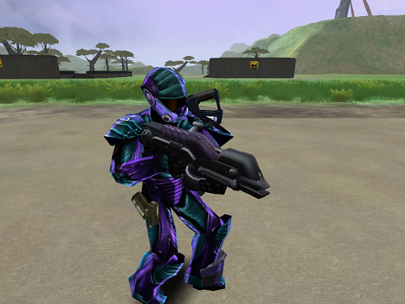

 Soldier with a
Pulsar\]\]

|                            |                                         |
| -------------------------- | --------------------------------------- |
| **Certification Required** | [Medium Assault](Medium_Assault.md)     |
| **Empire**                 | [Vanu Sovereignty](Vanu_Sovereignty.md) |
| **Primary Mode**           | Standard Bolt                           |
| **Secondary Mode**         | Armor Piercing Bolt                     |
| **Ammunition**             | [Energy Cells](Energy_Cell.md)          |
| **Range**                  | 200m                                    |
| **Inventory Dimensions**   | 3 x 6 (Rifle Holster)                   |
| **Magazine Capacity**      | 40                                      |
| **Zoom**                   | 4x                                      |

**Pulsar**

[image:Pulsar-Icon.jpg](image:Pulsar-Icon.md.jpg)

The [Pulsar](Pulsar.md) functions well as an outdoor
anti-infantry weapon, as it has a high projectile velocity, and good
accuracy, especially fired from a crouched position. The AP mode means
that even MAX units will fear sustained fire from this weapon.

Unlike the [Cycler](Cycler.md) and [Gauss](Gauss.md),
the [Pulsar](Pulsar.md)'s projectiles will not travel under
water. The Pulsar's [AP](Armor_Piercing.md) projectiles are also
not as powerful as the other empire's weapons, but this is offset by the
fact that the user can change ammo types instantly. A non-native user
will be unable to obtain the [energy ammunition](Energy_Cell.md)
from equipment terminals.

Shots to kill:

|                                               |                                       |
| --------------------------------------------- | ------------------------------------- |
| [Standard Exo-Suit](Standard_Exo-Suit.md)     | 7 shots                               |
| [Agile Exo-Suit](Agile_Exo-Suit.md)           | 8 shots                               |
| [Reinforced Exo-Suit](Reinforced_Exo-Suit.md) | 10 shots                              |
| [MAX](Mechanized_Assault_Exo-Suit.md)         | 58 [AP Mode](Armor_Piercing.md) shots |

(The above numbers are taken with 100 Health and full Armor; no
[MedKits](MedKit.md), [Implants](Implants.md) or [Empire
Incentives](Empire_Incentives.md) applied)

[Category:Game Items](Category:Game_Items.md)
[Category:Weapons](Category:Weapons.md) [Category:Vanu
Sovereignty Weapons](Category:Vanu_Sovereignty_Weapons.md)
