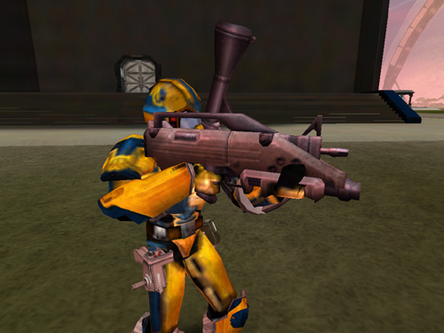

 Soldier equipped
with a Punisher\]\]

<table>
<caption><strong>Punisher</strong></caption>
<tbody>
<tr class="odd">
<td>
<strong>Certification Required</strong>
</td>
<td>
<a href="Medium_Assault.md" title="wikilink">Medium Assault</a>
</td>
</tr>
<tr class="even">
<td>
<strong>Empire</strong>
</td>
<td>
<a href="Common_Pool.md" title="wikilink">Common Pool</a>
</td>
</tr>
<tr class="odd">
<td>
<strong>Primary Mode</strong>
</td>
<td>
Single Shot
</td>
</tr>
<tr class="even">
<td>
<strong>Secondary Mode</strong>
</td>
<td>
Rocket/Grenade Launcher
</td>
</tr>
<tr class="odd">
<td>
<strong>Ammunition</strong>
</td>
<td>
Primary: 9mm Bullets (<a href="9mm_Bullet.md" title="wikilink">Standard</a> or <a href="AP_9mm_Bullet.md" title="wikilink">Armor Piercing</a>) 
Secondary: Rockets, Frag Grenades, Plasma Grenades or Jammer Grenades
</td>
</tr>
<tr class="even">
<td>
<strong>Range</strong>
</td>
<td>
Primary Mode: 200m
</td>
</tr>
<tr class="odd">
<td>
<strong>Inventory Dimensions</strong>
</td>
<td>
3 x 6 (Rifle Holster)
</td>
</tr>
<tr class="even">
<td>
<strong>Magazine Capacity</strong>
</td>
<td>
30
</td>
</tr>
<tr class="odd">
<td>
<strong>Zoom</strong>
</td>
<td>
2x
</td>
</tr>
</tbody>
</table>

**Punisher**

The [Punisher](Punisher.md) is the "Swiss army knife" of
PlanetSide weapons. In its primary mode, it fires 9mm rounds
(Anti-Infantry or Armor Piercing) fairly rapidly, although its shifty
cone of fire blooms after a few rounds, limiting its range considerably.
In its secondary mode, it can fire a single rocklet or grenade. A common
mistake for new players is to think the rocklet is an anti-vehicular
weapon. It is fairly useless against vehicles, but does reasonable
damage against stationary infantry.

A common tactic used for the weapon is to launch a [Fragmentation
grenade](Fragmentation_grenade.md) or [Plasma
grenade](Plasma_grenade.md) at an enemy, and then quickly switch
to primary mode to finish him off with bullets. Though to do this
properly, disabling [Auto Reload](Menu.md#Game_Options) in the
Game Options Menu is a must as otherwise you will be unable to fire
standard rounds until you have reloaded your
[Grenades](Weapons_Index.md#Grenades) or Rocket.

Shots to kill:

|                                                          |                                             |
| -------------------------------------------------------- | ------------------------------------------- |
| [Standard Exo-Suit](Standard_Exo-Suit.md)     | 8 shots                                     |
| [Agile Exo-Suit](Agile_Exo-Suit.md)           | 9 shots                                     |
| [Reinforced Exo-Suit](Reinforced_Exo-Suit.md) | 13 shots                                    |
| [MAX](MAX.md)                                 | 58 [AP](Armor_Piercing.md) shots |

(The above numbers are taken with 100 Health and full Armor; no
[MedKits](MedKit.md), [Implants](Implants.md) or [Empire
Incentives](Empire_Incentives.md) applied)

[Category:Game Items](Category:Game_Items.md)
[Category:Weapons](Category:Weapons.md) [Category:Common Pool
Weapons](Category:Common_Pool_Weapons.md)
