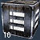

|                          |                                                                                                               |
| ------------------------ | ------------------------------------------------------------------------------------------------------------- |
| **Used by**              | [Mag-Scatter](Mag.$1.md "wikilink"), [Sweeper](Sweeper.md "wikilink"), [Jackhammer](Jackhammer.md "wikilink") |
| **Empire**               | [Common Pool](Common_Pool.md "wikilink")                                                                      |
| **Inventory dimensions** | 3x3                                                                                                           |
| **Quantity per pack**    | 16 shells                                                                                                     |

**Shotgun Shell**

Shotgun Shells are, as the name indicates, the ammunition used by
Shotguns. A Shotgun Shell contains multiple small pellets that, when
fired, are fired at the target. Because these pellets spread out after
being fired, it is important to be as close to the target as possible,
as to minimize the amount of pellets missing their target. Due to this,
Shotguns are used primarily indoors and in other close combat fights, as
they are very ineffective at anything beyond close proximity.

The Standard Shotgun Shells are best against non-armored targets, and
will do minimum damage to anything that has more armor than a
[Reinforced Exo-Suit](Reinforced_Exo.$1.md "wikilink"). In those
circumstances, [Armor Piercing Shotgun
Shells](Armor_Piercing_Shotgun_Shell.md "wikilink") are suggested.

Because Shotgun Shells are only used in small arms, they can penetrate
the shields of a [BattleFrame Robotic](BattleFrame_Robotics.md "wikilink").

[Category:Game Items](Category:Game_Items.md "wikilink")
[Category:Ammunition](Category:Ammunition.md "wikilink")
