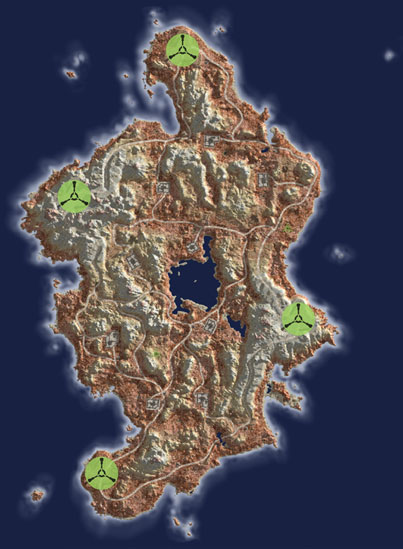
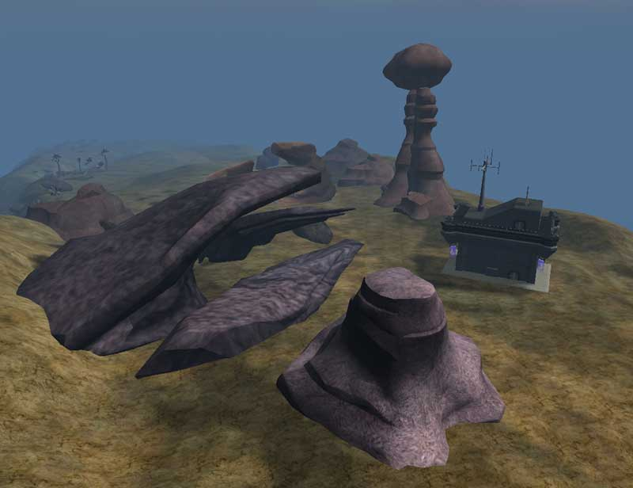

## Continental Data

|                                             |                                                                                   |
| ------------------------------------------- | --------------------------------------------------------------------------------- |
| Category:                                   | Inner Planet                                                                      |
| Climate:                                    | Desert                                                                            |
| Landmass:                                   | Continent                                                                         |
| Terrain:                                    | Plains, cliffs, mountains, plateaus, oasis, rocky shores                          |
| [Facilities](Facilities.md "wikilink"):     | 9                                                                                 |
| [Towers](Tower.md "wikilink"):              | 18                                                                                |
| Active [Warpgates](Warpgate.md "wikilink"): | 4                                                                                 |
| Active [Geowarps](Geowarp.md "wikilink"):   | 1                                                                                 |
| [Capitol](Capitol.md "wikilink"):           | [Interlink Facility](Interlink_Facility.md "wikilink") [Hapi](Hapi.md "wikilink") |

## Description

\]\] The large central
oasis of Solsar is flanked by two warp gates on plateaus nearby, making
it a unique tactical situation.

There are relatively few roads and very rough off-road terrain here,
making the bases more defensible to standard massed armor attacks.

---

Source: Planetside In-game descriptions, pre- and
post-[Bending](Bending.md "wikilink").

This continent is also refered to as
[Sol](Acronyms_and_Slang.md "wikilink"). Solsar is a [Home
Continent](Home_Continent.md "wikilink") with a
[Sanctuary](Sanctuary.md "wikilink") link to [Horus](Horus.md "wikilink"). See
[Home Continent](Home_Continent.md "wikilink") for the current empire
sanctuary links.

## Base [Facilities](Facilities.md "wikilink")

### [Amp Stations](Amp_Station.md "wikilink")

- [Mont](Mont.md "wikilink") ([Sub-Capitol](Sub-Capitol.md "wikilink"))
- [Bastet](Bastet.md "wikilink")

### [Bio Laboratories](Bio_Laboratories.md "wikilink")

- [Aton](Aton.md "wikilink")
- [Horus](Horus.md "wikilink")
- [Thoth](Thoth.md "wikilink") ([Capitol](Capitol.md "wikilink"))

### [Dropship Centers](Dropship_Center.md "wikilink")

- [Sobek](Sobek.md "wikilink") (Sub-Capitol)

### [Interlink Facilities](Interlink_Facilities.md "wikilink")

- [Hapi](Hapi.md "wikilink") (Sub-Capitol)

### [Technology Plants](Technology_Plant.md "wikilink")

- [Amun](Amun.md "wikilink") (Sub-Capitol)
- [Seth](Seth.md "wikilink")

[Category:Locations](Category:Locations.md "wikilink")
