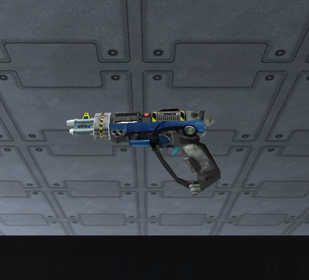

.\]\]

|                            |                                                    |
| -------------------------- | -------------------------------------------------- |
| **Certification Required** | [Medium Assault](Medium_Assault.md "wikilink")     |
| **Empire**                 | [New Conglomerate](New_Conglomerate.md "wikilink") |
| **Primary Mode**           | Single Shot                                        |
| **Secondary Mode**         | All-Magazine Burst                                 |
| **Ammunition**             | [10mm Multi-Phase](10mm_Multi-Phase.md "wikilink") |
| **Range**                  | 200m                                               |
| **Inventory Dimensions**   | 3 x 3 (Pistol Holster)                             |
| **Magazine Capacity**      | 6                                                  |
| **Zoom**                   | x2                                                 |

**Spear**

The **Spear** is a powerful [Medium Assault](Medium_Assault.md "wikilink")
pistol. It deals a good bit of damage per hit with a tight [cone of
fire](cone_of_fire.md "wikilink"), but small clip size. It also suffers
severe [Damage Degradation](Damage_Degradation.md "wikilink") (see graph at
right), making it relatively worthless at targets over 50 meters away.

In the primary firing mode, it fires as a single shot pistol with a
tight cone of fire.

The secondary mode fires all remaining rounds quickly with a very large
cone of fire. You must have at least 75 stamina to fire the secondary
mode. The drawback is that this mode drains all remaining
[stamina](stamina.md "wikilink"), leaving you vulnerable to attack. Thus,
you might want to think twice before firing in this mode. There is a
short delay before firing begins with the secondary fire mode (much like
the [Rocklet Rifle](Rocklet_Rifle.md "wikilink")), with a distinct sound.
This can sometimes give your target enough warning to move out of the
way.

At close range, the Spear will kill a soldier wearing
[Rexo](Rexo.md "wikilink") armor in 5 shots. The
[Eraser](Eraser.md "wikilink") and [Stinger](Stinger.md "wikilink") function
identically.

[Category:Game Items](Category:Game_Items.md "wikilink")
[Category:Weapons](Category:Weapons.md "wikilink") [Category:New
Conglomerate Weapons](Category:New_Conglomerate_Weapons.md "wikilink")
