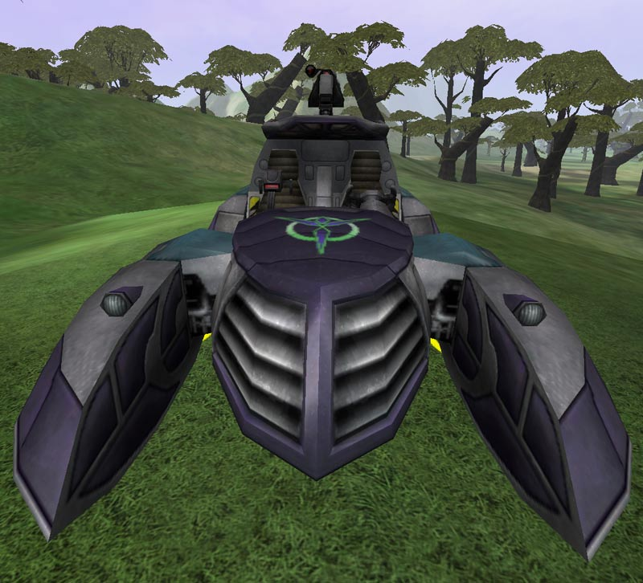

 Thresher\]\]
 like the
[Magrider](Magrider.md "wikilink")\]\]

|                            |                                                                                                         |
| -------------------------- | ------------------------------------------------------------------------------------------------------- |
| **Type**                   | Heavy Assault Buggy                                                                                     |
| **Role**                   | Attack                                                                                                  |
| **Certification Required** | [Assault Buggy](<Assault_Buggy_(Certification)> "wikilink") or [Light Scout](Light_Scout.md "wikilink") |
| **Empire**                 | [Vanu Sovereignty](Vanu_Sovereignty.md "wikilink")                                                      |
| **Primary Weapon**         | [Flux Cannon](Flux_Cannon.md "wikilink")                                                                |
| **Secondary Weapon**       | \-                                                                                                      |
| **Ammunition Used**        | [Flux Battery](Flux_Battery.md "wikilink")                                                              |
| **Occupants**              | 2 (Driver and Gunner)                                                                                   |
| **Handling**               | Good                                                                                                    |
| **Top speed**              | 85 kph (59 kph over water)                                                                              |

**Thresher**

The **Thresher** and its capibility to hover makes it the fastest and
most agile of all the empire specific [Assault
buggies](Vehicle_Index.md#Buggies "wikilink").

Designed for a two-person crew, a driver and a gunner position are
oriented side-by-side.

The gunner has access to the top-mounted "Flux Cannon," capable of
firing at high speeds in the full arc of horizontal motion. With a
magazine of 100 rounds, the gunner can fire for a good length without
reloading.

Driving the Thresher is similar to driving and maneuvering other
[Hovercraft](Hovercraft.md "wikilink"). The open cockpit allows the driver
and the gunner to wear up to [Reinforced
Exo-Suit](Reinforced_Exo.$1.md "wikilink").

[Category:Game Items](Category:Game_Items.md "wikilink")
[Category:Vehicles](Category:Vehicles.md "wikilink") [Category:Vanu
Sovereignty Vehicles](Category:Vanu_Sovereignty_Vehicles.md "wikilink")
[Category:Ground Vehicles](Category:Ground_Vehicles.md "wikilink")
