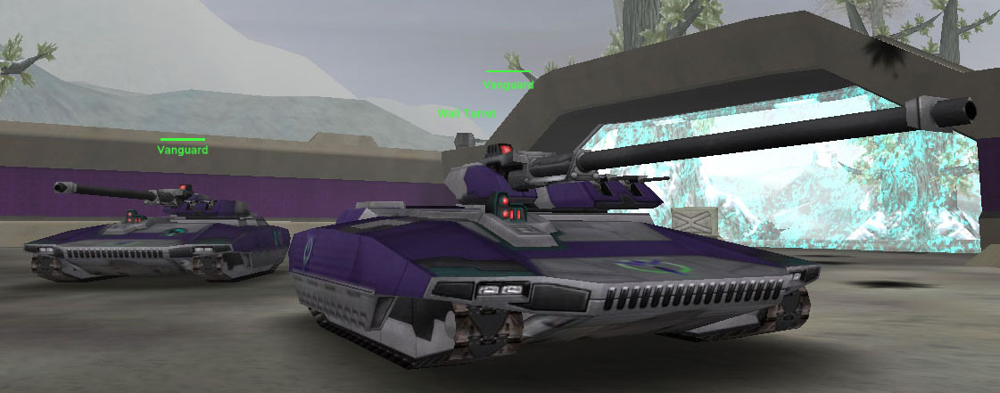

's [Medium Battle
Tank](Medium_Battle_Tank.md "wikilink")\]\]
\]\]

|                            |                                                                                                                               |
| -------------------------- | ----------------------------------------------------------------------------------------------------------------------------- |
| **Type**                   | [Medium Battle Tank](Medium_Battle_Tank.md "wikilink")                                                                        |
| **Role**                   | Attack                                                                                                                        |
| **Certification Required** | [Armored Assault I](Armored_Assault_I.md "wikilink") and [Armored Assault II](Armored_Assault_II.md "wikilink")               |
| **Empire**                 | [New Conglomerate](New_Conglomerate.md "wikilink")                                                                            |
| **Primary Weapon**         | 150mm Cannon                                                                                                                  |
| **Secondary Weapon**       | 20mm Recoilless Cannon                                                                                                        |
| **Ammunition**             | [150mm Tank Shells](<Tank_Shell_(150mm)> "wikilink") and [Recoilless Cannon Bullets](Recoilless_Cannon_Bullets.md "wikilink") |
| **Occupants**              | 2 (Driver and Gunner)                                                                                                         |
| **Handling**               | Average                                                                                                                       |
| **Top speed**              | 60 kph                                                                                                                        |

**Vanguard**

The Vanguard is the [New Conglomerate](New_Conglomerate.md "wikilink")'s
[Medium Battle Tank](Medium_Battle_Tank.md "wikilink"). It has a low side
profile and is the most heavily armored MBT. Its gunner can switch
between two guns. Its main gun does a lot of damage but fires slowly.
This makes it hard to engage moving targets and important that the first
shot is a hit. The secondary gun is dual 20mm cannons that is useful
against aircraft or targets at large distances.

The Vanguard requires a [Technology Plant](Technology_Plant.md "wikilink")
lattice link or [Sanctuary](Sanctuary.md "wikilink") vehicle pad in order
to be purchasable.

Shots to kill (with 150mm Cannon only):

|                                      |          |
| ------------------------------------ | -------- |
| [Lightning](Lightning.md "wikilink") | 4 shots  |
| [Prowler](Prowler.md "wikilink")     | 10 shots |
| [Magrider](Magrider.md "wikilink")   | 8 shots  |

(The above numbers are taken with full Armor; no Vehicle Shields
applied)

[category:Game Items](category:Game_Items.md "wikilink")

[Category:Vehicles](Category:Vehicles.md "wikilink") [Category:New
Conglomerate Vehicles](Category:New_Conglomerate_Vehicles.md "wikilink")
[Category:Ground Vehicles](Category:Ground_Vehicles.md "wikilink")
