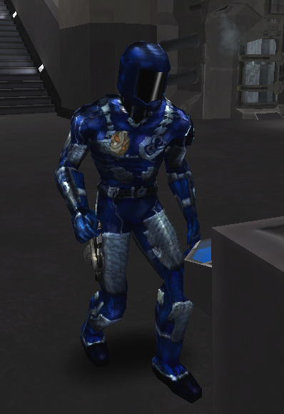

{ class="figure" }

](../images/TRInfilPicture.jpg){
class="figure" }

{ class="figure" }

{ class="figure" }

|                            |                                                                               |
| -------------------------- | ----------------------------------------------------------------------------- |
| **Certification Required** | [Infiltration Suit](<../certifications/Infiltration_Suit_(Certification).md>) |
| **Empire**                 | [Common Pool](../terminology/Common_Pool.md)                                  |
| **Armor**                  | 0                                                                             |
| **Pistol Holsters**        | 1                                                                             |
| **Rifle Holsters**         | None                                                                          |
| **Inventory Dimensions**   | 6 x 6                                                                         |
| **Other**                  | Allows the wearer to "cloak" (become invisible)                               |

**Infiltration Suit**

While this is not technically armor, the "stealth suit" allows you to cloak
yourself on the battlefield to avoid visual detection. It provides no armor
protection and has very littlie inventory space, save a single pistol slot.
Still, it is an extremely useful suit for reconnaissance and stealth.

Wearers of the **Infiltration Suit** are commonly known as "Cloakers." They are
visible when moving or shooting (see image) or with the use of the
[Darklight](../implants/Darklight.md) implant.
