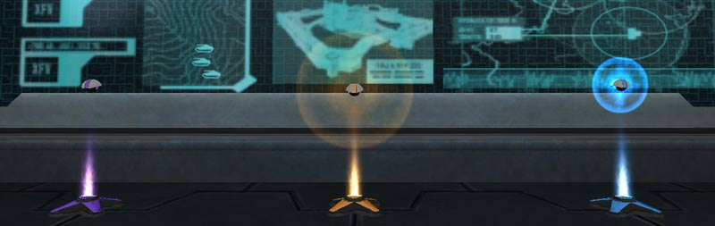
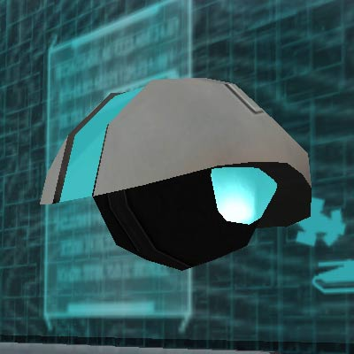

,
[Speed](Speed_Module.md), and [Equipment Modules](../items/Equipment_Module.md)
in their cradles in an [Interlink](../terminology/Interlink.md)
[Facility](../locations/Facilities.md)\]\] Modules are devices that can be
obtained from the [Module Buildings](../locations/Module_Building.md) in the
[Caverns](../locations/Caverns.md) introduced by the expansion
[Core Combat](../items/Core_Combat.md).

When installed inside a surface base [facility](../locations/Facilities.md),
modules grant the facility and the controlling empire a
[module benefit](../etc/Module_benefit.md) (apart from
[Facility Linked Benefits](../terminology/Facility_Linked_Benefit.md)),
depending on the type of module installed.

In order to obtain a module, one must go to the caverns, capture a
[Module Building](../locations/Module_Building.md), obtain a non-powered module,
and take it to the Core Complex to be charged. Once the module is removed from
the [Module Building](../locations/Module_Building.md), the player has fifteen
minutes to charge the module and bring it to the surface. Once on the surface,
the player has an additional fifteen minutes to install the module into a
friendly base. Once the module is placed in a
[Module Cradle](../items/Module_Cradle.md), all bases linked to the module will
receive the benefits.

Each [Empire](../terminology/Empire.md) has a limit of 10 [Modules](Modules.md)
that they can have installed at any given time. If exceeded, the only way to
gain more modules is to steal them from enemy bases that have them. Also, only
three modules can be in-transit in a cave at the same time. More modules cannot
be taken from their cradles until at least one is taken to the surface or the
timer expires on one. Taking a non-charged module to the surface causes the
module to disappear. If a charged Module is still in the cave when an enemy
empire captures the Module Building it was taken from, the module will explode
instantly, regardless of the timer.

Note: when carrying a module, your character will "flash" the color of the
module you picked up. Also, similar to the
[LLU](../terminology/Lattice_Logic_Unit.md), an icon will appear on the map
giving the location of you and the module for both friendlies and enemies to
see, thus it's best to have an escort to avoid an enemy from stealing the
module. A module icon flashing green means a friendly has picked it up. A red
flashing icon means an enemy has it, and a black flashing icon means the module
is on the ground. If the fifteen minute timer expires on the module, it will
start beeping a different sound and explode after a random delay between 1
second and 5 minutes, killing the carrier and anything nearby.

## Available Modules

\]\] Currently, six
types of modules are available to be installed (map icon color is listed):

- [Equipment Module](../items/Equipment_Module.md) (blue)
- [Health Module](../items/Health_Module.md) (yellow)
- [Pain Module](Pain_Module.md) (beige)
- [Shield Module](../items/Shield_Module.md) (aqua)
- [Speed Module](Speed_Module.md) (orange)
- [Vehicle Module](Vehicle_Module.md) (purple)

Empires may also try to achieve a [Cavern Lock](Cavern_Lock.md) which will
provide all six module benefits to any linked or chain linked facility as if
they had a module installed.

## Special Rules

The modules are unique constructs, and are subject to several special rules, in
the same vein as [LLUs](../terminology/Lattice_Logic_Unit.md).

1. Once installed in a facility, they cannot be removed by friendlies under
   normal circumstances. This is to prevent
   [griefing](../terminology/Grief_points.md). However, friendlies can remove
   modules from their own base if the enemy has the facility under
   [hack](../terminology/Hack.md).
2. Once installed at a facility, modules can only be stolen by enemies if one of
   two things happen.
   1. If the [facility](Facility.md)'s
      [Control Console](../locations/Control_Console.md) is
      [hacked](../terminology/Hack.md).
   2. If the facility's [generator](../items/Generator.md) is destroyed.
3. If the facility where the module is installed reverts to a
   [neutral](../terminology/Neutral.md) state, the module is destroyed, as it
   has no power.
4. Once installed at a facility, the module has a complete lifetime of roughly
   28 hours, which is also the cavern rotation cycle's time period.
5. The modules are extremely sensitive to changes in pressure. If a module is
   ever submerged in water, it will immediately detonate, destroying itself and
   anything near it.

<!-- -->

1. The modules become unstable when they are taken out of their
   [Module Cradle](../items/Module_Cradle.md). They will explode if they are out
   of their cradle for more than 15 minutes.

<!--[Category:Modules](Category:Modules.md)-->
