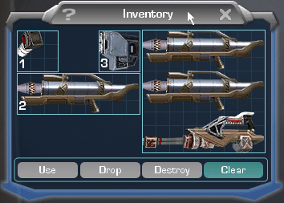

<b>This guide has become outdated</b>

It shall remain here for reference (and some nostalgia). I regret not being able
to finish it. Thanks to all those that supported me in my campaign to both hunt
the BFRs of the world, and teach other players how to turn it into an artform.
-NeoPhoenixTE/TR

<h1>

THE BFR Hunters' Handbook

</h1>
<table width="100%">
<tr>
<td valign="top" width="300">

**TOC**

</td>
<td valign="top">
<h2>

About the Author

</h2>

<small>If you'll pardon the ego, I'd like to give a lil history before I start
preaching about this.

I go by the alias
[NeoPhoenixTR](http://www.planetsidestats.net/players.php?world_id=15&char_id=751022)(NeoPhoenixTE
on the [forums](http://comms.planetsidesyndicate.com/member.php?userid=144), and the rest of the net), and my main character is
an [Emerald](Emerald.md) [TR](Terran_Republic.md)
[CR5](../terminology/Command_Rank.md). I have been playing PlanetSide for nearly
two years now, but have always been mediocre at shooter games overall. My
expertise comes in niche strategies and multitasking... just not aiming. \>\_\>

Ever since [BFRs](../vehicles/BattleFrame_Robotics.md) were first brought into
the game, I have had a constant fascination with them. True, some of this has
come from my personal love of the "mecha" genre of Anime, but it was also a new
dimension to the game. Many hated them, and still hate them, and that saddens
me. Despite what many may think, I love BFRs. However, like everything in my
life, the more I like something, the more I like to break it. I work on
computers and networks for a living...and I literally learned everything by
breaking, well, everything.

Sometime ago, the [Markov](Markov.md) TR named
[Blahman](http://www.planetsidestats.net/players.php?world_id=3&char_id=384070)
released a
[movie showing how to destroy a BFR as a solo grunt](http://www.planetsidemovies.com/modules.php?name=Downloads&d_op=viewdownloaddetails&lid=1088&title=How_to_Solo_a_BFR.wmv).
I watched this movie, and it got me to thinking about his approach. Soon after,
I had found myself dropping on BFRs and destroying them, each drop giving me
more experience for the next. It has been well over five months since then,
allowing me to alter and perfect the simple methods in Blahman's movie into a
more precise and effective method.

Most BFR pilots on Emerald know of my incessant love of "BFR Hunting" (or
"jihading" as people call it, but I _hate_ that term and wish it would get
replaced). In some cases, these pilots have come to fear this technique and my
name, despite the fact this was never the intent, ever. I was just bored and
found something I'm good at. :(

I am the first holder of the
[BFR Buster Platinum Merit](../merits/BFR_Buster.md) and have over 850 BFRs
kills recorded using the technique I will describe on this page. So, suffice it
to say, this technique works.

Those of you who wish to witness this technique in action are welcome to watch
my movie:
[Rampage of the BFR Hunter](http://www.planetsidemovies.com/modules.php?name=Downloads&d_op=getit&lid=2170).</small>

<h2>

About this guide

</h2>

<small>This handbook will attempt to explain the "art form" of BFR Hunting.

Why am I writing something so long? It seems people always ask me how I do this,
or how I do that, or what I recommend, or what about this. This handbook is to
answer every last one of those questions, and give recommendations. I will be
updating this guide over time (hopefully not _too_ long) as I go. Like I said,
should answer any questions I get (and make them stop :\|).

A second answer to that question could be that I like information. I like having
it, and I like making it. I compile stats for my outfit,
[KAAOS](../outfits/KAAOS.md), about our outfit nights and turn it into a 1-page
overview once the numbers are available from
[Rev's PlanetSide Stats page](http://www.planetsidestats.net), and use it to
draw conclusions on our performance that night. I'm just an information nut is
all.

I also like helping people out. During the writing of this guide, I have gotten
alot of good comments and critiques on it. People have loved it as I write it,
and I love writing it for people. During it's writing I had shown it to my
outfit, people who visit the
[Syndicate Comms](http://comms.planetsidesyndicate.com/), as well as very few
select people who have wanted to get into BFR Hunting who weren't part of the
first two groups. ;)

<s>This guide is scheduled for public
[official forum](Planetside_Official_Forums.md) release upon completion.</s>
Released to public on 6/7/2005.

Enjoy the guide! -Neo</small>

</td>
</tr>
</table>

**NOEDITSECTION**

## Section 1: BFR Hunting's Point and Purpose

"BFR Hunting" is the process of seeking out enemy
[BattleFrame](../vehicles/BattleFrame_Robotics.md) units and destroying them.
The purpose of this is to remove these units from the field, allowing your
empire's frames to gain an advantage in the struggle.

Other purposes of Hunting include:
[Battle Experience Points](../terminology/Battle_Rank.md), the
[BFR Buster Merit](../merits/BFR_Buster.md), and _"fame"_ of being a skilled BFR
Hunter.

All BFRs have a 20-minute timer on average, meaning any BFR that you destroy is
out of comission for a long time. This will allow for your own empire's
BattleFrames gain an advantage in the armor war for continental domination.

BFR Hunters, though often percieved as soloists who care not for their empire,
can prove invaluable in the fight. Even if there is only one or two of them, BFR
Hunters can help to turn a battle completely around via attrition.

Such power takes practice and dedication; that is why this guide is so blinkin'
long and detailed. There's more to BFR Hunting than simply dropping and
shooting.

## Section 2: The Tools of the Trade

This section will describe the basic essentials needed for BFR Hunting

### [Certifications](../certifications/Certifications.md)

#### Required Certs

In order to begin hunting, the following
[certs](../certifications/Certifications.md) are **required**:

- [Air Cavalry Scout](../certifications/Air_Cavalry_Scout.md) +
  [Assault](../certifications/Air_Cavalry_Assault.md)
- [Anti-Vehicular](../certifications/Anti-Vehicular.md)

This technique involves bailing from your aircraft onto the target battleframe,
and Aircav is the fastest and most effective way to approach BFRs. Both levels
are required due to the fact that if you repeat this technique, you _will_ get a
vehicle timer! Anti-Vehicular is what is used to make the kill itself.

#### Optimal Certs

The following certs are _optimal_ for BFR Hunting:

- [Heavy Assault](../certifications/Heavy_Assault.md)
- [Advanced Hacking](../certifications/Advanced_Hacking.md)

Heavy Assault is utilized in self-defense during a takedown. Best to have the
better gun. Advanced hacking is for when the pilot gets out, and you end up
killing them. Why leave an empty enemy frame there when you can bring it to your
side?

#### Optional Certs

The following certs are nowhere close to required, but can make a dedicated BFR
Hunter's life easier:

- [ATV](../certifications/ATV_(Certification).md)
- [Harasser](../certifications/Harasser_(Certification).md)

ATV and Harasser serve as a way to keep yourself from _ever_ waiting at a
vehicle pad. Though these vehicles are not as effective as Air Cavalry for
sneaking up on BFRs, experienced BFR Hunters can use these methods for a "balls
out" approach. Both vehicles are also a ton of fun, and the harasser can be used
to assist in [core module](Modules.md) and
[LLU](../terminology/Lattice_Logic_Unit.md) runs when you're not hunting.

### [Implants](../implants/Implants.md)

#### Required/Recommended Implants

For hunting, the only [implant](../implants/Implants.md) you need is
[Surge](../implants/Surge.md). However, as a personal recommendation, here are
the implants I employ in my personal hunting:

- [Surge](../implants/Surge.md)
- [Enhanced Targeting](../implants/Enhanced_Targeting.md)
- [Second Wind](../implants/Second_Wind.md)

Surge will be used to catch up to target battleframes. Enhanced Targeting is
effective at picking your targets wisely. Second Wind helps to keep your stamina
and health up for enough time to squeeze the killshot off.

#### Implants to Avoid

Implants to avoid using are:

- [Personal Shield](../implants/Personal_Shield.md)
- [Darklight](../implants/Darklight.md)

The reasoning behing my recommendation against personal shield is that, during a
takedown, _stamina is essential_. Darklight is also a stamina hog, and serves no
useful purpose during both a hunt and takedown. Like I said before, these
implants would be better off replaced with advanced targeting and second wind.
It's really up to you and your own personal playstyle as to what you do with
your other two implant slots.

### Knowledge

There are a few basic things you need to know before even starting to hunt.
These things are taught in my outfit, [KAAOS](../outfits/KAAOS.md)' training
courses, thus why I will tell anyone that wants to attend a live training
session to undergo the outfit's training. This section will only talk about the
basic essential knowledge.

#### Drop Animation & Guiding

The first bit of knowledge you need to know is how to kill the drop animation
after bailing from an aircraft.

When you bail from an aircraft, your client will enter a "cutscene" of sorts,
showing your character dropping down with the kinetic dampender effect trailing
behind it. This animation kills your field of vison while you are dropping, and
leaves you an open target to anyone that spots you as you fall.

There is a way to bypass this animation, and that is by simply taking your gun
out after you bail. Taking your gun out will put you back in a first-person
view, and it will allow you to look around, and even fire your weapon on the way
down.

While you are in the first person view, you can also guide your drop by simply
moving around. Point your reticle in the direction you wish to fall towards, and
simply move forward. This can also be helped by using the surge implant that you
have in order to make more significant adjustments.

#### Flight Basics

Like stated earlier, this approach requires the use of Aircav. In orer to
utilize it properly, one must know the basics of operating a
[Reaver](../vehicles/Reaver.md) and [Mosquito](../vehicles/Mosquito.md),
including:

- Basic Movement
- Afterburner Use
- Weapon Use (to defend yourself)

Basic movement is just pretty much knowing where to move your mouse/joystick to
go where, and how to hover and descend. Know the controls for your aircraft, and
practice flying around.

Afterburner use refers to knowing when to use your afterburners, and how to
utilize them correctly. A few tips:

- Don't burn it all at once, use enough of it to get the speed you want, and
  then lay off
- Fire in bursts to conserve your afterburner
- You can afterburn all the way into a [warpgate](../locations/Warpgate.md).
  Your afterburner will be fully replenished when you emerge on the other side.

Weapon use is literally just practicing your aim with the chaingun and rocket
launcher on the aircraft. You'll need to know this in situations in which you
need to defend your bird.

#### "The Force"

Like with everything in this game, one must attune a sense of situational
awareness while hunting. You must be able to "feel out" where everything is
simply by glancing at it. Despite how much this sounds like _"Use the Force,
Luke"_, it's actually true.

This kind of awareness can only be acquired by experience within PlanetSide, any
shooter game, as well as life itself. Without it, you will find yourself as
nothing more than a standing target that everyone will stare at, laugh at, and,
of course, shoot at.

<small>(Personal Note: Towards the beginning of my BFR Hunter "career", I had
been diagnosed with Adult ADHD (Attention Deficit Hyperactivity Disorder).
During this time, I had learned that ADD minds are simply wired differently, and
process thought in a different way. After some therapy and medication, I had
found my situational awareness increased. Just a note for those of you who may
actually have ADD. All those jerks that teased you in game about it...go blow up
their BattleFrames. ;D)</small>

#### Kiss your K/D Goodbye

Dedicated BFR Hunters die, and they die alot. In fact, they always die more than
they kill (unless it's been a really really _really_ good night). If you are out
to have a positive K/D ratio, I warn you now, this guide wont tell you how to
get it. True, your BEP count will likely skyrocket, but you'll be spending over
60% of your time respawning and getting back in the air.

BFR Hunting can be frustrating, and often times, it is _very_ frustrating. Just
know that BFR Hunting isn't for everyone, and it'll get you a lot of stress if
you take it seriously. This is why I recommend a break every 10 drops or so,
just to keep the mind fresh and to get some air.

## Section 3: The Deci-Swap Technique

Another bit of knowledge one must know is the Deci-Swap Technique. This
technique is used to increase the firing rate of the
[Decimator](../weapons/Decimator.md) by swapping it with another, and is
**essential** to taking down BFRs.

<b>UPDATE:</b> This technique has been removed from the game, invalidating the
majority of this guide. This guide is now simply an archive of a past strategy.

[This technique appears as an exploit to many people](#Deciswap_Exploit).
However, there are also those of the opinion that it is no less dirty than
mastering the use of the tripleshot [Jackhammer](../weapons/Jackhammer.md), and
even see it as a skill that requires alot of practice to master. There are a few
choice threads on the [Official Forums](Planetside_Official_Forums.md) talking
about the morality of using the Deci-Swap technique, but this section isn't
about how "legal" Deci-Swapping is. Let's move on to what this section*is*
about.

### [Inventory](../terminology/Inventory.md) Loadout

The first step to learning this technique is knowing the type of loadout to use
when BFR Hunting. The loadouts presented here are _recommended_ loadouts,
meaning you can adjust them as you see fit.

#### Required Items

There are rules that **must** be followed when building loadouts:

- You must carry at least three (3) [Decimators](../weapons/Decimator.md)
- You must carry at least one (1) [Jammer Grenade](../weapons/Jammer_Grenade.md)
- You must be in [Agile Armor](../armor/Agile_Exo-Suit.md)

Three Decimators give you a total of nine shots. Typical
[Gunner Variant BFRs](../vehicles/BattleFrame_Robotics.md#The_Variants) take 4-5
decimator shots. This is assuming you hit the armor with every shot. While this
only requires 2 decimators, the third one is needed for the deci-swap technique
itself (plus it's insurance for those of us with either bad aim or lousy pings).

The one jammer grenade is needed to slow a BFR to a speed in which it can be
engaged, as well as disable a few systems, rendering it an easy target.

Agile armor is required due to the fact that you cannot pilot an aircraft in
[Rexo](../armor/Reinforced_Exo-Suit.md), and the inventory space of both the
[Infiltrator](../items/Infiltration_Suit.md) and
[Standard Armor](../armor/Standard_Exo-Suit.md) is insufficient to carry your
payload.

#### The Poor Man's Loadout

<table width=100%>
<tr>
<td width=390 valign=center align=center>

{ class="figure" }
<small>Example of a "Poor Man's Loadout"</small>

</td>
<td valign=top>

The first loadout described is for those who don't have the certs for
[Heavy Assault](../certifications/Heavy_Assault.md). This is good for characters
who are at very low [Battle Ranks](../terminology/Battle_Rank.md) that need to
make some quick [BEP](../terminology/Battle_Experience_Points.md) by hunting.

The loadout to the left satisfies the minimum conditions with the 3 Decimators,
and the Jammer. Also, note that the first Decimator is in the active rifle (or
number 2) holster. The [Sweeper Shotgun](../weapons/Sweeper.md) is a good choice
for a defensive weapon from the
[Medium Assault](../certifications/Medium_Assault.md) pool. It specializes in
close-combat, and is common-pool, so the price is right. The
[REK](../weapons/Remote_Electronics_Kit.md) is totally optional. It's
recommended if you have
[Advanced Hacking](../certifications/Advanced_Hacking.md), and it's also a good
idea to keep a REK on you at all times anyways. ;)

**WARNING!** _Make sure your defensive weapon is loaded with standard (white)
ammo! AP (gold) ammo wont help you here!_

An important thing to note in this loadout is the spacing indicated in the
picture by the yellow box. Make sure you leave that spacing there, meaning
putting your gun all the way on the left side of the inventory backpack. The
reasoning behind this space is simple. When you swap your defensive weapon (the
Sweeper in this case) into your active rifle holster, you wont drop the
Decimator that was in your active holster while in combat.

Resist that urge to put a second jammer, pistol-sized item, or even box of ammo
in there. That jammer, pistol, or ammo could cost you the kill later on.

</td>
</tr>
</table>

#### The Optimal Loadout

<table width=100%>
<tr>
<td width=390 valign=center align=center>

{ class="figure" }
<small>Example of an Optimal BFR Hunter Loadout</small>

</td>
<td valign=top>

The second loadout described is for those who have advanced a few Battle Ranks
and can afford the big guns. This is the loadout I personally use when BFR
hunting.

Since we're now using Heavy Assault weapons, the common-pool weaponry is out the
window. This is where problems can occur between empires. Given the
empire-specific weapons, the [TR](Terran_Republic.md) and the
[NC](New_Conglomerate.md) have the best defensive HA weapons, while the
[VS](Vanu_Sovereignty.md) are at a disadvantage. The TR's
[Mini-Chaingun](../weapons/Mini-Chaingun.md) has a 100 bullet clip that is
capable of killing 2-3 grunts before running dry. The NC's
[Jackhammer](../weapons/Jackhammer.md) is like the Sweeper, but bigger,
specializing in close-combat. The VS' [Lasher](../weapons/Lasher.md), however,
only has 25 shots, and is at a disadvantage outdoors, where any BFR takedown
will be taking place. My recommendation is that any VS BFR Hunter stick to the
Sweeper used in the "Poor Man's Loadout" described earlier.

**WARNING!** _Make sure your defensive weapon is loaded with standard (white)
ammo! AP (gold) ammo wont help you here!_ <small>(yes, second time, it's _that_
important)</small>

Something noted in the last section, the Decimator in the active rifle holster
by defeault, is also present in this loadout. The reasoning behind this is that
you need to be firing a Decimator first when you land on your target. This
placement saves time and effort later on from not having to swap out your
defensive weapon for a Decimator. This makes more sense in the next section.

</td>
</tr>
</table>

### The Technique Itself

Enough about how to setup your loadouts. Time to get on with the moves!

#### HUD Setup

<table width=100%>
<tr>
<td width=390 valign=center align=center>

{ class="figure" }
<small>Mouse cursor position at the start of a Deci-Swap</small>

</td>
<td valign=top>

There are two things you must do before attempting the Deci-Swap Technique:

- Bind your inventory key to something _very_ close and easy (mine is set to "R"
  using the WASD setup)
- Have your mouse cursor in position to swap

The Deci-Swap technique requires you to be able to open your inventory, right
click, and close your inventory again all within a 2-second window. Having your
cursor in this postion before opening your inventory will allow you to do this.

Before challenging a BFR, open your inventory, and place your cursor on one of
the other Decimators like the one in the picture is. Then close your inventory.
Next time you open your invetory window, your mouse cursor will still be there.

**WARNING!** _Going into your map between setting your cursor and opening it
again for the Deci-Swap will reset the cursor's postion to center!_

This is where being nervous and/or obsessive compulsive can save your butt! Keep
flicking your inventory while en-route to a target to check the postioning...as
well as get all that nervous energy out in your little finger there.

</td>
</tr>
</table>

#### Fire-Swap-Pull-Fire

Okay! You've gotten the loadout, you've setup your HUD...now for the technique
itself!

<table width=100%>
<tr>
<td width=390 valign=center align=center>

{ class="figure" }
<small>Mouse Movement during the Deci-Swap</small>

</td>
<td valign=top>

The Deci-Swap is basically this:

- Pull out your Decimator and fire it
- Pull up your inventory
- Swap a new Deci in by right-clicking on one in your inventory
- Close your inventory
- Pull out your (new) Decimator and fire it
- Repeat

Sounds easy, doesn't it. Did I mention the entire cycle should take no more than
3 seconds? Yeah, my hand's cramping too.

During this process, during one of your swaps (the 3rd or 4th shot at latest),
you need to move your mouse cursor (as shown in the picture) to the "third deci"
to swap in. The reasoning behind this (and why you even brought that third
Decimator) is that you need to keep firing off Decimators at this accelerated
rate. If you keep swapping the same two Decimators, they will both run out, and
you'll be stuck firing that third one at "normal" speeds (which you may as well
just point at the ground cause you are likely screwed by now). Swap the third
one in to simply delay the ammo running dry on the other two so you always have
two Decimators to fire.

</td>
</tr>
</table>

### Practicing

Chances are you're still reading the last section, especially the part about
doing all that within 3 seconds per cycle. Once you've torn yourself away from
that, you're probably gonna call me insane and tell me no man alive can do it
that fast. Well, go check out the movie I posted at the top of this article, and
then tell me it's impossible.

The most important part of the Deci-Swap technique is practicing it. Doing
something that complex in such a short amount of time requires practice. With
enough practice, the Deci-Swap Technique can become like walking, or typing. And
with practice, your speed will increase. Don't expect to completely "wtfpwn" the
first BFR you challenge with this technique. Good chance you will fumble the
swap, drop a decimator, or get stuck in mouse cursor mode while trying to aim. I
still do to this day. :\\

Here's a couple scenarios that I recommend for Deci-Swap practice.

<table width=100%>
<tr>
<td valign=center align=center width=400>

{ class="figure" }
<small>Rexo Loadout for Deci-Swap Combat Practice</small>

</td>
<td valign=top>
<h4>

In Private

</h4>

<s>First you get some lotion, and then-</s> Find a good quiet place, such as a
backline base, or even VR, and just practice the motions. Do it at whatever
speed your are comfortable with, and constantly try to increase your speed as it
starts to feel more natural. In time, you won't even need to read any notes.
You'll just be able to do it! I recommend getting comfortable in this
environment before moving onto the next one.

<h4>

Combat Practice

</h4>

It's great that you can deci-swap like a champ in a quiet room...but how about
when there's gunfire, yelling, and people all around you that want to kill you?
Yeah, your concentration may get a bit frayed then.

Try to pack two Decimators in your standard grunt loadouts, and practice the
swap against MAX units (and enjoy the "hax" tells!) While this wont let you
practice switching to the "third Deci," it will allow you to get the motions
down while in head-to-head combat.

**REXO WARNING!** _Make sure you have your Decimator in your first active rifle
holster (number 2 again). Any Rifle-sized item you swap in will go into that
rifle holster!_

This type of practice is the kind the average grunt may be doing already. This
same technique has been used to bypass the refire time of a
[Bolt Driver](../weapons/Bolt_Driver.md), much like it bypasses the Decimator
refire time.

Another fun way to practice that _does_ let you practice the "third Deci" is to
use an enemy [Generator](../items/Generator.md) as a test dummy for your BFR
Hunter loadout. Simply load up your agile loadout, wait for surge, surge through
to the enemy gen, and swap away while blasting that gen. See how fast you can
swap all three with the thought of your pursuing foes in your head.

</td>
</tr>
</table>

## Section 4: Hunting BattleFrames

You got your loadout, you got your moves, now you just need your target: Enemy
BattleFrames.

### Defensive Flying

The main approach to BFRs, like stated earlier, is
[Air Cavalry](../certifications/Air_Cavalry_Assault.md). So, let's start with
how to proceed to your targets.

<h4>

Use The World

</h4>

Unless you happen to be an ace pilot as well as a BFR Hunter, you should try t
stay out of sight. Best way to do this is to use the world to hide yourself. Few
quick tips:

- Fly high on Ishundar and Hossin. The fog hides your aircraft well on both
  these continents. (You just have to get low enough to see your target when
  it's time)
- Use hills and third person. Hills provide excellent cover from being spotted,
  and even shot at. You can even hide behind a ridge and flick to third person
  to see over it. This is especially useful on Ceryshen by floating just under a
  ledge, and "ledge camping" with your aircraft.

<h4>

The Scenic Route

</h4>

If you cannot use the world for cover, avoid it all together.

- Avoid roads and direct "as the crow flies" routes between bases.
- Fly out over the water
- Avoid areas where you yourself would fly between objectives.

The overall objective of this kinda defensive flying is to not be spotted. Not
being spotted keeps your bird alive enough so you can bail on your target.
Should you be spotted and get engaged by enemy aircraft, you can either run for
it and try to bail on the closest target BFR you can find, or you can try to
fight your way out of it. It's really up to you and your own personal skill as a
pilot.

### "The Game Trails"

It's good to avoid the enemy...but where do you seek the target?

Every continent and battle has a series of "Game Trails." These are areas where
BFRs will be moving to and from targets. They are also places where large armor
conflicts could be taking place.

Good "Game trail" examples include:

- Bridges (especally the Ceryshen bridge between Sedna and Anguta)
- Roads
- Direct land routes between two bases
- Areas between towers and their respective base

But, these aren't the only places. This is where use of "The Force" may be
needed. You need to be able to "feel out" your enemy. Quite literally asking "If
I were a BFR pilot looking for kills, where would I go and how would I get
there?" It may be common sense, but, alot of people tend to look for BFRs just
at towers and bases. Even though they often are there, it's always best to catch
them on the way there in the middle of nowhere where they are (preferably)
without their support troops and vehicles.

### Picking the target

As if the corny "game trail" terminology wasn't enough, I offer this phrase to
start:

_"Think like a Lion...strike like a Lion..."_

Lions are hunters in the wild, and the fact that you are hunting BattleFrames
(in the wild no less) means that you and a Lion can follow the same three rules:

- Pick on the slow
- Pick on the sick/wounded
- Pick on the ignorant

Picking on the slow would mean targetting gunner variants. These variants have
alot of armor, but can't outrun infantry while jammed.

Picking on the sick and wounded would mean finding a damaged BFR, and finishing
it off. This would require use of the
[Enhanced Targeting](../implants/Enhanced_Targeting.md) implant to spot low
health bars, or just a keen sense of how hurt a BFR is simply by how it moves.
If a BFR is running*away* from a target, good chance that it's probably hurt, or
at least in no shape to attack. This also applies to enemy frames that are under
attack by friendly forces. I myself tend to drop in on a BFR being targetting by
my own empire, seeking both the kill and the glorious cheers from teammates.
<small>(Some actually calling it a "priviledge to watch the legend at work!" Do
[KingAildiyan](http://www.planetsidestats.net/players.php?world_id=15&char_id=365707)
and [Ash](http://www.planetsidestats.net/players.php?world_id=15&char_id=273559)
go through this? seriously)</small>

Picking on the ignorant, despite how cruel it may seem, is just as effective. If
you see a BFR that's doing something that makes it an easy target (such as a
flight variant crouching while camping or a gunner variant camping against a
wall), attack it! Who knows, the enemy may thank you for raising their
collective average IQ a little. ;)

## Section 5: The Takedown

### Dropping

### Placement

You're on the ground, now what? It's time to make use of surge and head for the
sweet spot! These are ideal placements for you to be during a takedown.

#### Against [Terran Republic](Terran_Republic.md) Frames

<table width=100%>
<tr>
<td align=center valign=center>

<small>Placement under a TR [Colossus](../vehicles/Colossus.md) or
[Invader](../items/Invader.md)</small>

</td>
<td valign=top>

Description here

</td>
</tr>
</table>

#### Against [New Conglomerate](New_Conglomerate.md) Frames

<table width=100%>
<tr>
<td align=center valign=center>

<small>Placement under an NC [Peregrine](../vehicles/Peregrine.md) or
[Eagle](../vehicles/Eagle.md)</small>

</td>
<td valign=top>

Description here

</td>
</tr>
</table>

#### Against [Vanu Sovereignty](Vanu_Sovereignty.md) Frames

<table width=100%>
<tr>
<td align=center valign=center>

<small>Placement behind a VS [Aphelion](../vehicles/Aphelion.md) or
[Eclipse](../vehicles/Eclipse.md)</small>

</td>
<td valign=top>

Description here

</td>
</tr>
</table>

### Aiming

You're in the sweet spot, now where do you shove that deci-swap? Well, that all
depends on what kind of BFR you are fighting. Here are recommended spots to aim
during the deci-swap and the takedown.

#### Against [Terran Republic](Terran_Republic.md) Frames

<table width=100%>
<tr>
<td align=center valign=center width=400>

{ class="figure" }
<small>Where to aim against a TR [Colossus](../vehicles/Colossus.md) or
[Invader](../items/Invader.md)</small>

</td>
<td valign=top>

Like alot of things in the guide thusfar, this should seem common sense.
However, there are people who think they have to do some weird things.

Let's just clarify here. You _do not_ need to nail these things in the legs. If
properly executed, and done quickly, the yellow box in the picture is the only
place, as well as the safest place, to aim your deci-swap shots.

You will annhilate their trunk, their sensors, possibly the flight pod on an
Invader, and the gunner pod on a Colossus. Though, the ultimate goal is to just
blow every last component up, down to the last nut and bolt.

Keeping your aim restricted to this box is a good way to make sure every
decimator hits the frame, and delivers its payload.

</td>
</tr>
</table>

#### Against [New Conglomerate](New_Conglomerate.md) Frames

<table width=100%>
<tr>
<td align=center valign=center>

<small>Where to aim against an NC [Peregrine](../vehicles/Peregrine.md) or
[Eagle](../vehicles/Eagle.md)</small>

</td>
<td valign=top>

Description here

</td>
</tr>
</table>

#### Against [Vanu Sovereignty](Vanu_Sovereignty.md) Frames

<table width=100%>
<tr>
<td align=center valign=center>

<small>Where to aim against a VS [Aphelion](../vehicles/Aphelion.md) or
[Eclipse](../vehicles/Eclipse.md)</small>

</td>
<td valign=top>

Description here

</td>
</tr>
</table>

## Section 6: Hunter Breakers

### Gunner Bails

### Enemy Support

### BOOT TO DA HEAD

## Section 7: Conclusion

## Appendix

### Unanswered Questions

1. 

   Deci-Swapping: Is this a bannable exploit?

   

   - At the time of this writing, no.
     [Samhayne has already replied to one of the posts concerning the "decimator exploit"](http://psforums.station.sony.com/ps/board/message?board.id=psdiscussion&message.id=543881#M543881)
     calling it an "unintended feature" at the moment. This means that the
     Deci-Swap could be killed off in a later patch, but it is not a bannable
     offense.

2. Second question goes here
   - Second answer goes here.

### Graphic Index

- Aiming regions
  - [Against TR Frames](#ColossusTakedownAim)
  - [Against NC Frames](#PeregrineTakedownAim)
  - [Against VS Frames](#AphelionTakedownAim)
- Deci-Swap Loadouts
  - [Actual](#The_Poor_Man.27s_Loadout)
  - [Practice](#RexoPracticeLoadout)
- Takedown placement
  - [Against TR Frames](#ColossusTakedownPlacement)
  - [Against NC Frames](#PeregrineTakedownPlacement)
  - [Against VS Frames](#AphelionTakedownPlacement)

### Reference

#### Websites

- [BFR Hunter Rampage Movie](http://www.planetsidemovies.com/modules.php?name=Downloads&d_op=getit&lid=2170)
- [KAAOS Forums](http://forums.kaaos.com)

#### BFR Hitbox Pictures

- Aphelion
- [Colossus Hitbox Diagram](Media:ColossusHitbox.jpg) <small>(pictures courtesy
  of GlenMichael, TR Emerald)</small>
- Eagle
- Eclipse
- [Invader Hitbox Diagram](Media:InvaderHitbox.jpg) <small>(pictures courtesy of
  GoHokieGo, TR Emerald)</small>
- Peregrine

