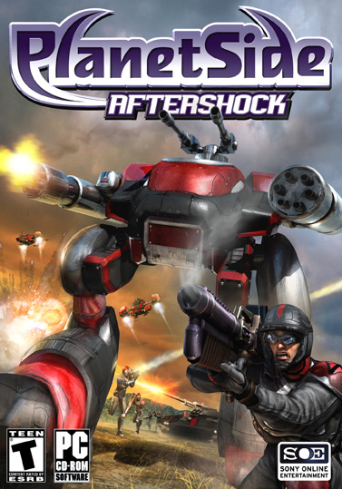

[PlanetSide](PlanetSide.md) is one of the first Massively-Multiplayer Online
First Person Shooters (MMOFPS), and was published and developed by
[Sony Online Entertainment](Sony_Online_Entertainment.md). The game was first
released on May 20th, 2003, and has undergone numerous updates since then,
including [Core Combat](../items/Core_Combat.md) and
[The Bending](The_Bending.md). PlanetSide received an ESRB rating of Teen. The
game is purely a multiplayer affair, and has only been released for the Windows
Operating System.

## Story

After traveling through a womrhole, the [Terran Republic](Terran_Republic.md), a
highly centralized galactic government which has ruled humans for the past 1,112
years, discovered the planet of [Auraxis](../locations/Auraxis.md). Several
expeditions were sent through the wormhole to colonize Auraxis, and soon after
the colonists discovered the remains of an ancient alien race, the Vanu. This
allowed for the rapid colonization of the ten continents of Auraxis, as well as
development of new technologies, most importantly - rebirthing technology.
Rebirthing technology allowed humans to deconstruct and reconstruct their
bodies, but more importantly, workers who had lost their lives could be brought
back to life using rebirthing technology.

However, the colony was soon cut off as the wormhole collapsed, and dissension
brewed within the ranks within the Republic. A loss of faith in the Terran
Republic caused the colonists to split into three very distinct factions and a
war over technology began.

### Terran Republic

The [Terran Republic](Terran_Republic.md) consists of colonists who remained
loyal to the Republic, and is a conservative, authoritarian collectivist nation
with the goal of re-establishing contact with the homeworld and re-unite the
warring factions. Thier leadership comes in the form of a public oligarchy known
as the Overwatch, composed of various representive officials and thier
ministries, who regulate their parts of society with their own expertise and the
collective will create favorable outcomes. The Republic feels that authority is
the bastion that protects humanity. They feel that in a free society, with no
Big Brother figure, misery and suffering will be quickly visited to all. The
Republic regards the Vanu technology as dangerous and volatile force which
threatens the stability of their order, and only use it in warfare begrudingly.
The Republic view of the future is one of peace through their benevolent rule,
and a reunited colony through the reopening of the wormhole. The Republic stands
by the view that the Vanu were extinct by their meddling with orders of power
and fear that using this technology again will drive humanity into a similar
fate, causing as much damage to reality along the way. The Republic relies on
the brute strength of their armies and fleets, and the application of their
superior firepower.

### New Conglomerate

The [New Conglomerate](New_Conglomerate.md) is a militant seperatist faction
composed of anarchists, liberals, and libertarians determined to break and
remain free from the domineering Republic. They seek to liberate all of humanity
from the Republic, regardless of whether or not they share the Conglomerate's
view. As a group of rebels, their leadership lies within the Revolutionary
Command, a visible group of military experts who guide the liberation efforts as
a whole. They feel that any type of control is oppression, and would rather be a
miserable free man than a contented slave. They view Vanu technology as a tool
of control, and that the Sovereignty are simply technochratic tyrants, would-be
dictators under the banner of science, and just as bad as the Republic, if not
worse. Their ideal view of the future is one of freedom and self-government,
where each man flourishes in his own way as he sees fit. The Conglomerate relies
on their strength in numbers and their ability to strike fast with light
vehicles and infantry.

### Vanu Sovereignty

The [Vanu Sovereignty](Vanu_Sovereignty.md) is a loose transhumanist cult of
academics, intellectuals, and technology worshippers who believe that the future
of humanity lies within the exploitation of alien technology. Their leadership
is the Sovereignty Council, whose composition is unknown to even the members of
the Sovereignty and is completely obscured to non-members of the Sovereignty.
They see the Republic as an outmoded restriction on the continued development of
alien technology and cotinued development of the species through synthesis of
man and machine. They also see the Conglomerate as a savage band of thugs,
possessed by a mob rule and refuse to see that technology is the future of
humanity. The ideal Sovereignty future is one of scientific purity and
perfection, and believe that the Vanu race used the power of their advanced
sciences to transcend their corporeal limitations and the mundane world,
ascending to a superior state of being, and, ultimately, a higher plane of
existance. They envision humanity following a similar path, first through the
enhancement of humans through science, and, ultimately, the replacement of
humans by machines. The Sovereignty is the most reliant on alien technology, and
often use it to overcome their shortcomings through the superiority of their
engineering, utilizing mind bending physics and high-energy arrays to defend
themselves.

### Analysis

Within the game, there has been much discussion over which factions are
inherently _good_ or _evil_. Some claim the Republic to be the
[empire](../terminology/Empire.md) that was intended to be the villains of the
game, due to the theoretical similarity to _Fascism_, although it can be argued
that neither the Republic nor Fascism are inherently bad, as they are only doing
what they feel is right on the whole, which is protecting humanity from its own
incompetence. These same people also tend to contest that the New Conglomerate
are the heroes of the game, however, this is also contestable. The New
Conglomerate is rabidly anti-everyone and see no room for beliefs other than
their own, and also because of the fact that, living in a Liberal Democracy, one
might be pre-inclined to see liberty as the cheif concern. Most people agree
that the Sovereignty are at least partial villains, due to their embrace of
technologies today we say as immoral, and due to their notion of replacing
humans with machines. However, this may also be contested as our understanding
of such technology such as cloning and genetic engineering stem from the latest
science fiction film. Ultimately, it seems as though the developers of
PlanetSide were attempting to make each of the factions good in someways, but
none of them have are morally better than the other, and all of them have some
sort of moral bankruptcy within their backstories. Also, each of the empires are
far too fanatical one-sided about their own views to be taken seriously as a
point.

## Gameplay

At any one time in the game, thousands of soldiers can be fighting across many
different types of environments in many different types of vehicles or on foot.
PlanetSide is one of the first first person shooters with a persistent war, with
one simple goal in mind of all of the players: gain more land while denying the
other two factions from gaining land. There are many opportunities within
PlanetSide to use tactics, but learning the intricacies and depth of battles can
take many months. PlanetSide does not suffer from the 'hands-off' feel of many
other Massively Multiplayer Online Games.

## Leveling and Experience

Although PlanetSide is a first person shooter at heart, it does have a levelling
system. Players can gain
[Battle Experience Points](../terminology/Battle_Experience_Points.md) to gain
[Battle Ranks](../terminology/Battle_Rank.md) which can be used to get
[certifications](../certifications/Certification.md),
[implants](../implants/Implants.md), and uniform upgrades.
Also, through leading, a player can gain
[Command Experience Points](../terminology/Command_Experience_Points.md) to gain
[Command Ranks](../terminology/Command_Rank.md), which give the players
different command related abilities.

## Updates

The game is still being actively supported by
[Sony Online Entertainment](Sony_Online_Entertainment.md), with a patch being
released about once a month. These [patches](../terminology/Patch.md) usually focus
on fixing in-game bugs and adding new content. PlanetSide also has a
[Test Server](Test_Server.md) like other online games to test changes before
they go onto live servers.
 box art.\]\]

### Core Combat

On October 27, 2003, PlanetSide's first expansion pack,
[Core Combat](../items/Core_Combat.md) was released. This expansion pack added
new areas and new weapons for players.

#### Story

A new area underneath several [continents](../locations/Continent.md) was
discovered. These [caverns](../locations/Caverns.md) appear to be the remnants
of the ancient Vanu civilization. [Geowarps](../locations/Geowarp.md) on six
continents, [Hossin](../locations/Hossin.md),
[Amerish](../locations/Amerish.md), [Ceryshen](../locations/Ceryshen.md),
[Oshur](../locations/Oshur.md), [Solsar](../locations/Solsar.md) and
[Forseral](../locations/Forseral.md), were discovered that led to caverns
underneath these continents. These caverns reflected the continent above, but no
colonist from the Republic had ever seen them before. The Geowarps appeared from
thin air, and were not there when the Republic originally surveyed the surface
of these continents, and there were no reports of anyone building these
Geowarps.

Sovereignty scientists speculate that these caverns were used by the Ancients as
a staging house for energies that swept over the entire planet. Also, these
underground chambers were not for habitation, but were merely baffles and
routing structures for these energies. However, due to an information leak
within the Sovereignty scientists, the other two empires also know how to
activate the Geowarps and how to take advantage of the information inside of the
caverns.

Because of this, the three empires are using these new areas to produce new
technologies for war, but because all three empires have access to the Geowarps,
no empire has a technological advantage. However, these new technologies could
change the face of the battlefield.

#### Changes to Caverns

With more recent [patches](../patches/Patches.md), the way the caverns work has
changed. Rather than having the six caverns being linked to the same six
continents all the time, two caverns are open at any time and are linked to
random continents on the surface, and the other four caverns have a countdown
timer to when they will be opened.

#### Ancient Modules

With these caverns came the addition of [modules](Modules.md). These are
powerful tools, which, when installed in a surface [facility](../locations/Facilities.md),
grant that facility and all other friendly facilities in the lattice certain
benefits. The six types of modules are
[equipment](../items/Equipment_Module.md), [health](../items/Health_Module.md),
[pain](Pain_Module.md), [shield](../items/Shield_Module.md),
[speed](Speed_Module.md), and [vehicle](Vehicle_Module.md).

#### Criticism

Many users criticize Core Combat as an expansion pack, as they feel the content
added was not enough to justify its purchase. They feel that the new equipment
and vehicles added in Core Combat aren't accessible enough, as it can be fairly
difficult to acquire this
[Ancient Technology](../terminology/Ancient_Technology.md) equipment. Also, many
people state that fights in the caverns do not happen often enough to justify a
purchase of Core Combat.

### [The Bending](The_Bending.md)

On August 14, 2004, the planet Auraxis underwent a change. For a few days before
this happened, the planet had been undergoing constant
[meteor](../items/Meteor.md) showers. No one knew what these meant, but people
kept fighting on. Right before it happened, the meteor showers became heavier,
and then, right before it happened, you could hear the words "Bending Sequence
Initiated".

Everyone was forced to respawn back at their sanctuary. Everything looked the
same, but soldiers noted the different stars. Each of the continents was pushed
off of Auraxis and became a smaller planet on their own. The warpgates still
funcioned under the normal [lattice](../terminology/Lattice.md), but the skies
were different. Also, [Oshur](../locations/Oshur.md) was removed completely, and
in its place were the [Battle Islands](../locations/Battle_Islands.md).
 box art.\]\]

### Aftershock

Aftershock was released on October 18th, 2004. While some people refer to
Aftershock as a second expansion, Aftershock is simply a repackaging of the
original PlanetSide along with [Core Combat](../items/Core_Combat.md). However,
Aftershock marked the introduction of a new gameplay element,
[BattleFrame Robotics](../vehicles/BattleFrame_Robotics.md) (BFR's).

## See Also

- [Core Combat](../items/Core_Combat.md)
- [Events](Events.md)
- [Patches](../patches/Patches.md)

## External Links

- [The Official _PlanetSide_ Website](http://www.planetside.com/)

<!--[Category:PlanetSide](Category:PlanetSide.md)-->
