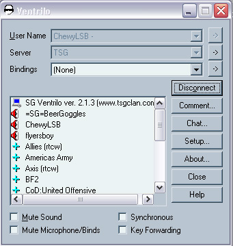

 [Ventrilo](Ventrilo.md) is
a scalable Voice over IP communication program created by Flaship
Industries, Inc. Users download the Ventrilo client and then connect to
a Ventrilo server. Users usually communicate through use of a headset or
a microphone, but these are not required to run Ventrilo. Default sound
quality is similar to a telephone's sound quality, but the quality can
be changed by switching to a different codec.

Ventrilo is often used for online gaming when reflexes are an issue and
time cannot be wasted typing out responses. Rather, gamers use Ventrilo
to communicate with members on the same team as them for tactical
reasons. Some [outfits](../terminology/Outfit.md) in
[PlanetSide](PlanetSide.md) use Ventrilo, and some go as far as
to mandate Ventrilo to be a member of the [outfit](../terminology/Outfit.md).

## See Also

- [Teamspeak](TeamSpeak.md)

## External Links

- [The Ventrilo Home Page](http://www.ventrilo.com/)

<!--[category:Communication](category:Communication.md)-->
