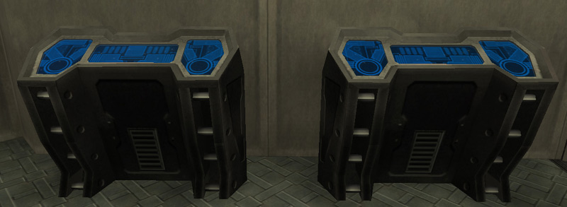

Located on each [Empire](../terminology/Empire.md)'s
[Sanctuary](../locations/Sanctuary.md) and in
[Bio Lab](../locations/Bio_Laboratory.md) Facilities only, Certification
terminals are found on the upper and lower floors of the
[HART](../terminology/HART.md) building and are used for the purchasing and
forgetting of [Certifications](../certifications/Certifications.md).

To use, simply approach the terminal and press the Use key (default G), as
instructed on-screen.

The interface is simple; a list on the left shows the certifications available
for purchase and the right is split into two panels, the upper showing a
description of the currently selected cert and any prerequisites, and the lower
listing the certs the character currently posesses. The number of available
[Certification points](../certifications/Certification_points.md) is shown at
the top, and the time remaining until another cert may be forgotten is shown
underneath.

Certification Terminals can be destroyed as of [2.5.5](../patches/2.5.5.md)

<!--[Category:Game Items](Category:Game_Items.md)-->
