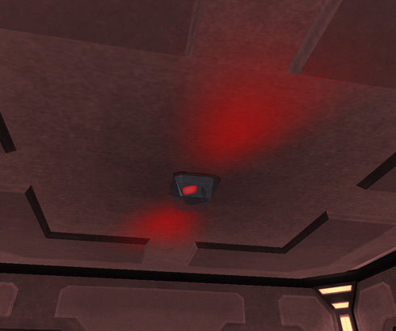

\]\]
 Warning Light: Generator
Destroyed\]\]

The **generator** converts the [NTUs](NTU.md) of a base into usable energy to
fuel base systems and terminals, as well as the self-repair mechanisms of the
base.

Taking this generator offline results in the terminals and systems of the base
being taken offline, including the spawn tubes. The only exception is the
[Control Console](../locations/Control_Console.md), which runs on its own power
supply. It also disables any
[Facility Linked Benefits](../terminology/Facility_Linked_Benefit.md) the base
may be providing. As well, the facility becomes a dead link in the Lattice
system, blocking benefits from bases behind it on the lattice. Additonally, it
releases the [modules](../etc/Modules.md) that may be installed in that
facility. This means they can be removed or stolen from their
[cradles](Module_Cradle.md). A destroyed generator will repair itself, albeit
very slowly, as long as the base has a supply of NTUs remaining.

Because the generator is such an important part of facility defense, and even
continental defense, a warning is issued throughout the entire Sphere of
Influence ([SOI](../locations/Sphere_of_Influence.md)) if it comes under attack.

The generator room is also one of the areas protected by a
[Pain Field](../terminology/Pain_Field.md) when a
[Pain Module](../etc/Pain_Module.md) is installed at the base, as a
[Lattice Benefit](../terminology/Facility_Linked_Benefit.md), or from a
[Cavern Lock](../etc/Cavern_Lock.md) Benefit. An
[Expert Hacker](../certifications/Expert_Hacking.md) can also hack into the
[Generator Terminal](../items/Generator_Terminal.md) to create or increase a
pain field in the generator room.

<!--[Category:Game Items](Category:Game_Items.md)-->
