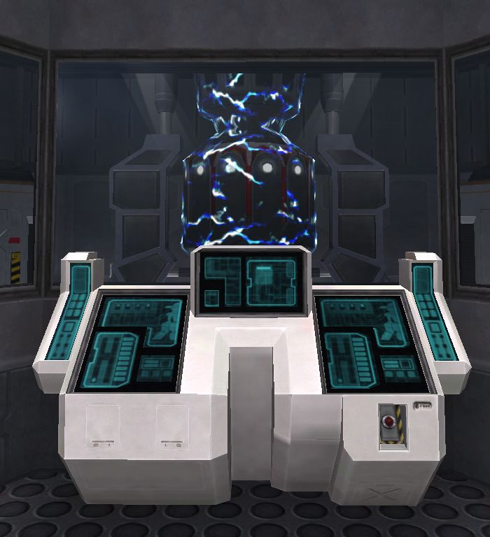

{ class="figure" }

The [Generator Terminal](Generator_Terminal.md) is located at the entrance of
the [Generator](Generator.md) of each [base](../locations/Facilities.md).
Friendly [Expert Hackers](../certifications/Expert_Hacking.md) can use their
[REK](../weapons/Remote_Electronics_Kit.md) to hack into the terminal to divert
power to generate a [Pain Field](../terminology/Pain_Field.md) in the generator
room. The pain field created by this process is the equivalent of a
[Pain Module](../etc/Pain_Module.md) in terms of strength. If the facility is
receiving a Pain Module benefit and also upgraded in this manner, the pain field
has intense strength (3 times stronger than a pain module pain field).

Facilities with upgraded generator pain fields will display a special icon on
the [Continental Map](../etc/Continental_Map.md) and will last for 30 minutes
after the last boost.

