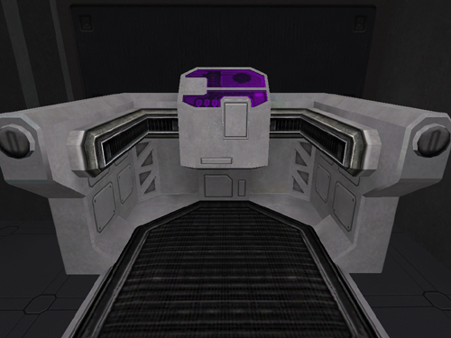

Medical Terminals can be found in all
[Facilities](../locations/Facilities.md) (except [Towers](../locations/Towers.md))
and in the [HART building](../locations/HART_building.md) in
[Sanctuary](../locations/Sanctuary.md). There are usually 2 Medical Terminals
in each base. One is located behind the [spawn
room](spawn_room.md) in the [barracks](../locations/Barracks.md) (or
[Research Room](../locations/Research_Room.md) in a [Bio
Laboratory](../locations/Bio_Laboratory.md)) and another one in or near the
[Main lobby](../locations/Main_lobby.md) (Bio Labs feature an [Advanced
Medical Terminal](Advanced_Medical_Terminal.md) near the lobby
instead of a regular one).

While standing in a Medical Terminal a soldier's Health and Armor will
be healed at approximately ten (10) points per second, up to the
soldier's maximum.

<!--[Category:Game Items](Category:Game_Items.md)-->
