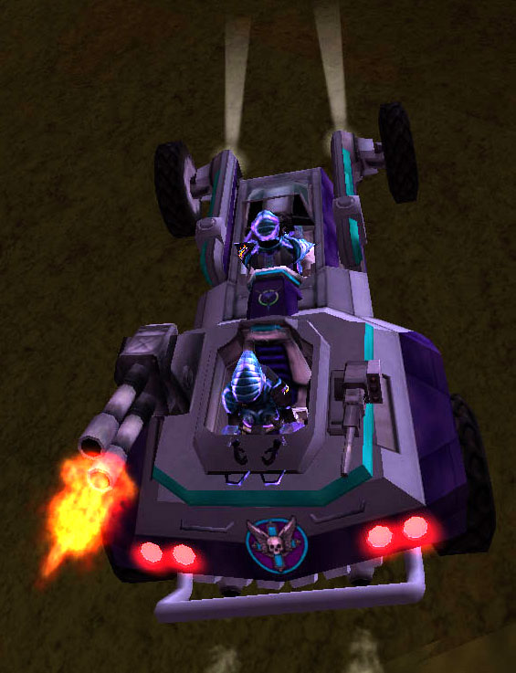

|                            |                                                                                                                                     |
| -------------------------- | ----------------------------------------------------------------------------------------------------------------------------------- |
| **Type**                   | Heavy Assault Buggy                                                                                                                 |
| **Role**                   | Anti-Aircraft                                                                                                                       |
| **Certification Required** | [Assault Buggy](<Assault_Buggy_(Certification)>) or [Light Scout](../certifications/Light_Scout.md)                             |
| **Empire**                 | [Common Pool](../terminology/Common_Pool.md)                                                                                            |
| **Primary Weapon**         | [Flak](../weapons/Flak.md) Cannon                                                                                                   |
| **Secondary Weapon**       | 12mm machine gun                                                                                                                    |
| **Ammunition Used**        | [Flak Cannon Ammunition](../ammunition/Flak_Cannon_Ammunition.md) and [Rotary Chaingun Bullets](ammunition/Rotary_Chaingun_Bullets.md) |
| **Occupants**              | 2 (Driver and Gunner)                                                                                                               |
| **Handling**               | Good                                                                                                                                |
| **Top speed**              | 80 kph                                                                                                                              |

**Skyguard**

The **Skyguard** is the only true Anti-Aircraft vehicle in the game. It
employs a flak projectile system as its primary weapon, and a 12mm
machine gun as its secondary. When the flak projectile is fired at an
air target, and only at an air target, it explodes, making short work of
any single piloted aircraft. The **Skyguard** is a very fast and agile
vehicle, but has very light armor.

The open cockpit of this vehicle will allow the driver to wear up to
[Reinforced Exo-Suit](../armor/Reinforced_Exo-Suit.md).

The **Skyguard** was introduced in release [1.5](1.md.5) in
June, 2003. [category:Vehicles](category:Vehicles.md)
[category:Ground Vehicles](category:Ground_Vehicles.md)
[category:Common Pool
Vehicles](category:Common_Pool_Vehicles.md)

[Category:Game Items](Category:Game_Items.md)
