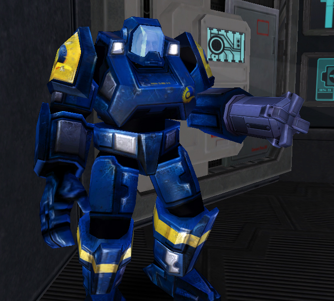

's Anti-Aircraft
[MAX](Mechanized_Assault_Exo-Suit.md)\]\]

|                            |                                                                                                                                            |
| -------------------------- | ------------------------------------------------------------------------------------------------------------------------------------------ |
| **Certification Required** | [Anti-Aircraft MAX](<../certifications/Anti-Aircraft_MAX_(Certification).md>) or [Uni-MAX](<../certifications/Uni-MAX_(Certification).md>) |
| **Empire**                 | [New Conglomerate](../etc/New_Conglomerate.md)                                                                                             |
| **Armor**                  | 650                                                                                                                                        |
| **Primary Mode**           | Normal fire                                                                                                                                |
| **Secondary Mode**         | \-                                                                                                                                         |
| **Magazine Capacity**      | 12                                                                                                                                         |
| **Ammunition**             | Missiles                                                                                                                                   |
| **Range**                  | Lockon: 350m Dumbfire: 500m                                                                                                                |
| **Special Ability**        | Shield                                                                                                                                     |

**Sparrow**

The [New Conglomerate](../etc/New_Conglomerate.md)'s
[Anti-Aircraft MAX](<../certifications/Anti-Aircraft_MAX_(Certification).md>)
**Sparrow** configuration packs a powerful punch. After a relatively lengthy
lock-on, its anti-air missiles feature a "fire-and-forget" tracking system,
which will follow and attempt to strike the target aircraft for up to 500m. The
automated tracking system makes it hard for pilots to avoid the missiles, which
do reasonable damage. The missiles can also be dumb-fired and have splash damage
upon impact, making the Sparrow quite useful for defending against infantry as
well as aircraft.

<!--[Category:Game Items](Category:Game_Items.md)-->
