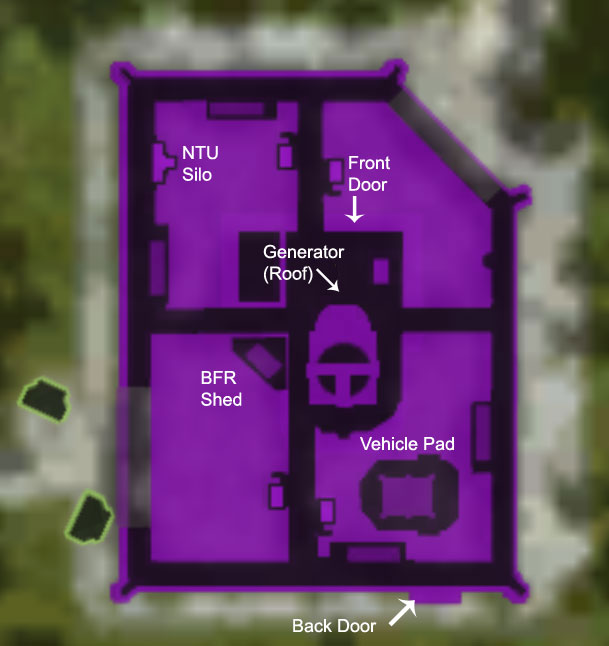

{ class="figure" } Bio Laboratory
[facilities](Facilities.md) are the weakest in terms of defense, as their
[generators](../items/Generator.md) are located on the rooftop of the facility.
The Bio Laboratory grants a faster [respawn](../terminology/Respawn.md) time to
all units spawning at any friendly facilities connected to it on the
[Lattice](../terminology/Lattice.md).

The [Control Console](../locations/Control_Console.md) for this base is in the basement,
level 1. The [LLU](../terminology/Lattice_Logic_Unit.md) Socket is located on
Basement Level 2 (below the research lab next to the
[Respawn room](Spawn_Room.md)}

Unique feature - medical room with an
[Advanced Medical Terminal](../items/Advanced_Medical_Terminal.md) and
[Lockers](../items/Lockers.md) located next to the [main lobby](../locations/Main_lobby.md).
They are also the only facilities outside of [Sanctuary](../locations/Sanctuary.md) with
[Certification](../items/Certification_Terminal.md) and
[Implant](../items/Implant_Terminal.md) terminals.

## Base Facility Specs

|                                                                                                                  |                                                 |
| ---------------------------------------------------------------------------------------------------------------- | ----------------------------------------------- |
| [Control Console](../locations/Control_Console.md):                                                                           | Level 1                                         |
| [Generator](../items/Generator.md):                                                                              | Roof                                            |
| [Spawn room](Spawn_Room.md):                                                                                     | Level 1                                         |
| [Vehicle Terminal](../locations/Vehicle_Terminal.md) (Air/Ground):                                                            | Courtyard                                       |
| [BFR Shed](../items/BFR_Shed.md):                                                                                | Courtyard                                       |
| [Certification Terminals](../items/Certification_Terminal.md)/[Implant Terminals](../items/Implant_Terminal.md): | Level 1                                         |
| [Lattice Logic Unit](../terminology/Lattice_Logic_Unit.md) Socket:                                               | Basement                                        |
| [Facility Linked Benefit](../terminology/Facility_Linked_Benefit.md):                                            | Reduce Respawn timer (benefit icon: spawn tube) |
| [Wall Turrets](../items/Phalanx.md):                                                                             | 6                                               |
|                                                                                                                  |                                                 |

## Bio Laboratory Locations

### [Amerish](Amerish.md)

- [Ikanam](../facilities/Ikanam.md)
- [Kyoi](../facilities/Kyoi.md) (Sub-Capitol)
- [Onatha](../facilities/Onatha.md)
- [Xelas](../facilities/Xelas.md) (Sub-Capitol)

### [Ceryshen](Ceryshen.md)

- [Sedna](../facilities/Sedna.md) (Sub-Capitol)
- [Tootega](../facilities/Tootega.md) (Sub-Capitol)
- [Tarqaq](../facilities/Tarqaq.md)

### [Cyssor](Cyssor.md)

- [Chuku](../facilities/Chuku.md)
- [Honsi](Honsi.md)
- [Itan](../facilities/Itan.md)
- [Mukuru](../facilities/Mukuru.md)
- [Shango](../facilities/Shango.md)

### [Esamir](Esamir.md)

- [Freyr](../facilities/Freyr.md) (Sub-Capitol)
- [Mani](../facilities/Mani.md) (Sub-Capitol)
- [Ran](../facilities/Ran.md)
- [Ymir](../facilities/Ymir.md) (Sub-Capitol)

### [Forseral](Forseral.md)

- [Lugh](../facilities/Lugh.md)
- [Neit](../facilities/Neit.md) (Capitol)
- [Ogma](../facilities/Ogma.md) (Sub-Capitol)

### [Hossin](Hossin.md)

- [Acan](../facilities/Acan.md) (Sub-Capitol)
- [Bitol](../facilities/Bitol.md) (Sub-Capitol)
- [Zotz](../facilities/Zotz.md)

### [Ishundar](Ishundar.md)

- [Dagon](../facilities/Dagon.md)
- [Hanish](../facilities/Hanish.md)
- [Lahar](../facilities/Lahar.md)
- [Zaqar](../facilities/Zaqar.md)

### [Oshur Battle Islands](Oshur.md)

- [Rashnu](../facilities/Rashnu.md)
- [Yazata](../facilities/Yazata.md)

### [Searhus](Searhus.md)

- [Akua](../facilities/Akua.md)
- [Drakulu](../facilities/Drakulu.md)
- [Hiro](../facilities/Hiro.md)
- [Iva](../facilities/Iva.md)

### [Solsar](Solsar.md)

- [Aton](../facilities/Aton.md)
- [Horus](Horus.md)
- [Thoth](../facilities/Thoth.md) (Capitol)

