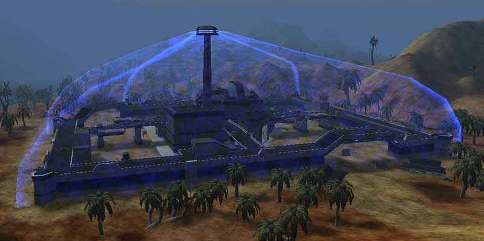

 on [Solsar](Solsar.md) with
[Force Dome](../items/Force_Dome.md) activated\]\] One [facilty](Facilities.md)
on each [Empire](../terminology/Empire.md)'s Home [continent](Continent.md) is
designated as the **Capitol**. During the [Post-Bending](../etc/The_Bending.md)
era, control of this facility gave the dominating empire use of the continental
[warpgates](Warpgate.md) as
[broadcast warpgates](../items/Broadcast_warpgate.md).

Each Capitol is linked to 4 [Sub-Capitol](Sub-Capitol.md) facilities. Control
over at least two of these Sub-Capitols activates an impenetrable (for opposing
Empires) [Force Dome](../items/Force_Dome.md) over the Capitol.

The Capitol's [generator](../items/Generator.md) and hack status do not affect
the operation of the Force Dome. Only the ownership status of the Sub-Capitols
will deactivate it. (Capitol generators affect facility equipment, as normal.
The Capitols' control console affects only the hack status of the Capitol, which
is independent of the Force Dome status. Thus, a hack on the
[Control Console](Control_Console.md) can still complete - even though the Force
Dome is up.)

The Capitol's [Control Console](Control_Console.md) cannot be hacked unless an
opposing Empire owns at least two of the Sub-Capitols for that Capitol.

[Orbital Strikes](../commands/Orbital_Strike.md) cannot be triggered over a
capitol, or in close proximity of one, regardless of the
[Force Dome](../items/Force_Dome.md) status.

## Capitol and Sub-Capitol Index

- [Solsar](Solsar.md): [Thoth](../facilities/Thoth.md)
  ([Hapi](../facilities/Hapi.md), [Mont](../facilities/Mont.md),
  [Sobek](../facilities/Sobek.md), [Amun](../facilities/Amun.md))
- [Hossin](Hossin.md): [Voltan](../facilities/Voltan.md)
  ([Acan](../facilities/Acan.md), [Ixtab](../facilities/Ixtab.md),
  [Bitol](../facilities/Bitol.md), [Naum](../facilities/Naum.md))
- [Forseral](Forseral.md): [Neit](../facilities/Neit.md)
  ([Ogma](../facilities/Ogma.md), [Pwyll](../facilities/Pwyll.md),
  [Gwydion](../facilities/Gwydion.md), [Caer](../facilities/Caer.md))
- [Ceryshen](Ceryshen.md): [Anguta](../facilities/Anguta.md)
  ([Sedna](../facilities/Sedna.md), [Nerrivik](../facilities/Nerrivik.md),
  [Akna](../facilities/Akna.md), [Tootega](../facilities/Tootega.md))
- [Esamir](Esamir.md): [Eisa](../facilities/Eisa.md)
  ([Jarl](../facilities/Jarl.md), [Ymir](../facilities/Ymir.md),
  [Freyr](../facilities/Freyr.md), [Mani](../facilities/Mani.md))
- [Amerish](Amerish.md): [Verica](../facilities/Verica.md)
  ([Cetan](../facilities/Cetan.md), [Mekala](../facilities/Mekala.md),
  [Sungrey](../facilities/Sungrey.md), [Qumu](../facilities/Qumu.md))

---

sources: online manual

<!--[Category:Locations](../Category:Locations.md)-->
