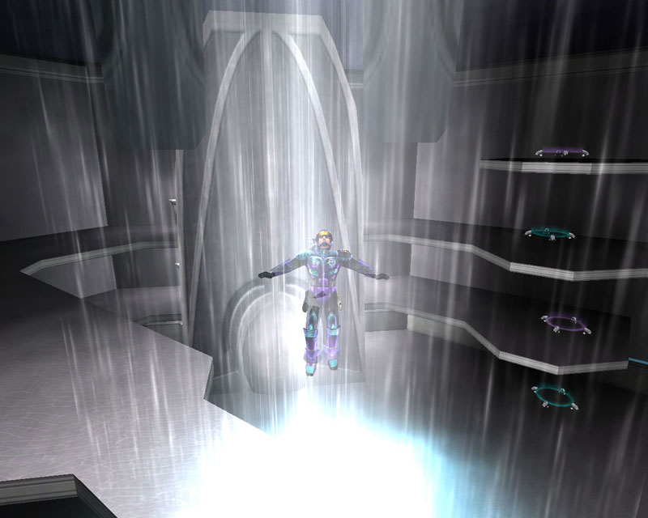

 The Core Complex is the
large crystaline structure located at the center of each of the
[Core Combat](../items/Core_Combat.md) [CavCaverns.mdrns.md).

At the center of this structre is a white column of light. Stepping into this
beam of light is fatal, with two exceptions:

- Soldier is carrying an uncharged [Module](../etc/Modules.md). The beam will
  charge the module, ready for installation in a surface
  [Facility](Facilities.md) [Module Cradle](../items/Module_Cradle.md).

<!-- -->

- Soldier is ready to [Imprint](../terminology/BFR_Imprint.md) in preparation
  for [BattleFrame Robotics](../vehicles/BattleFrame_Robotics.md) certification.
  Once the proper requirements have been met, the beam will allow soldiers to
  certify BFR from that point on.

While in the beam under the above two circumstances, you are immune to damage.

Unlike the other Cavern Base Facilites, the Core Complex has no
[Ancient Control Console](../items/Ancient_Control_Console.md), and cannot be
captured by any [Empire](../terminology/Empire.md).

Entry to the building is by [Zipline](../items/Zipline.md), or
[Teleporter](../terminology/Teleporter.md) ring pairs. Navigation inside is also
by Teleporter.

<!--[Category:Locations](Category:Locations.md)-->
