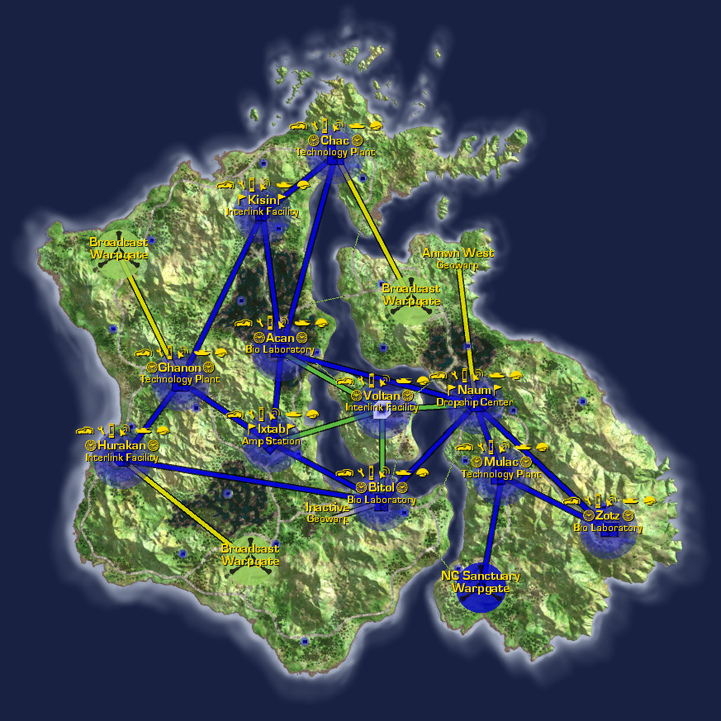
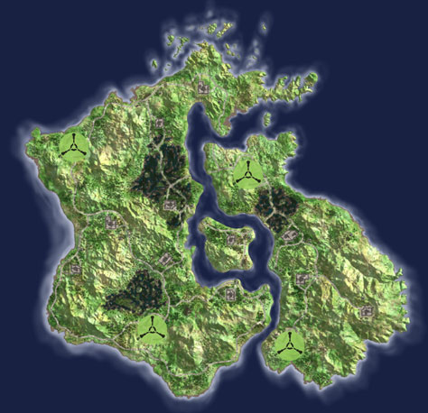

## Continental Data

|                                  |                                                                                     |
| -------------------------------- | ----------------------------------------------------------------------------------- |
| Category:                        | Caustic Atmosphere                                                                  |
| Climate:                         | Humid, Temperate                                                                    |
| Landmass:                        | Continent                                                                           |
| Terrain:                         | Swampy lowlands, lush interiors, causeways, rolling hills, slow rivers, mountains.  |
| [Facilities](Facilities.md):     | 11                                                                                  |
| [Towers](Towers.md):             | 18                                                                                  |
| Active [Warpgates](Warpgate.md): | 4                                                                                   |
| Active [Geowarps](Geowarp.md):   | 1                                                                                   |
| [Capitol](Capitol.md):           | [Interlink Facility](Interlink.md) [Voltan](../facilities/Voltan.md) |

## Description

Heavy clouds hang in the atmosphere here and the oxygen levels are low, although
the air is dense with other elements. (Troops regularly activate their
bio-containment fields when operating on Hossin.)

This lush, temperate continent has low-lying hills and boggy swamps dotting the
terrain that lure the unwary into thinking straight-line of travel would be
easiest, much to their later dismay.

The [continent](Continent.md) is divided by a river in the center which splits
and surrounds an island on its way through the continent. On this island is the
[Capitol](Capitol.md) of Hossin, [Voltan](../facilities/Voltan.md), an
[Interlink Facility](Interlink.md).

Hossin is a [Home Continent](Home_Continent.md). A [Sanctuary](Sanctuary.md)
warpgate links to the [Mulac](../facilities/Mulac.md) Technology Plant in the
south east. The continent's other [warpgates](Warpgate.md) link from
[Ghanon](../facilities/Ghanon.md) to [Sungrey](../facilities/Sungrey.md) on
[Amerish](Amerish.md), [Hurakan](../facilities/Hurakan.md) to
[Wakea](../facilities/Wakea.md) on [Searhus](Searhus.md), and
[Chac](../facilities/Chac.md) to [Baal](../facilities/Baal.md) on
[Ishundar](Ishundar.md). See [Home Continent](Home_Continent.md) for the current
empire sanctuary links.

This continent is also refered to as
[Hos](../terminology/Acronyms_and_Slang.md).

Source: PlanetSide In-game descriptions, pre- and post-[Bending](../etc/The_Bending.md).

## Base [Facilities](Facilities.md)

### [Amp Stations](Amp_Station.md)

- [Ixtab](../facilities/Ixtab.md) ([Sub-Capitol](Sub-Capitol.md))

### [Bio Laboratories](Bio_Laboratory.md)

- [Acan](../facilities/Acan.md) (Sub-Capitol)
- [Bitol](../facilities/Bitol.md) (Sub-Capitol)
- [Zotz](../facilities/Zotz.md)

### [Dropship Centers](Dropship_Center.md)

- [Naum](../facilities/Naum.md) (Sub-Capitol)

### [Interlink Facilities](Interlink.md)

- [Hurakan](../facilities/Hurakan.md)
- [Kisin](../facilities/Kisin.md)
- [Voltan](../facilities/Voltan.md) ([Capitol](Capitol.md))

### [Technology Plants](Technology_Plant.md)

- [Chac](../facilities/Chac.md)
- [Ghanon](../facilities/Ghanon.md)
- [Mulac](../facilities/Mulac.md)

