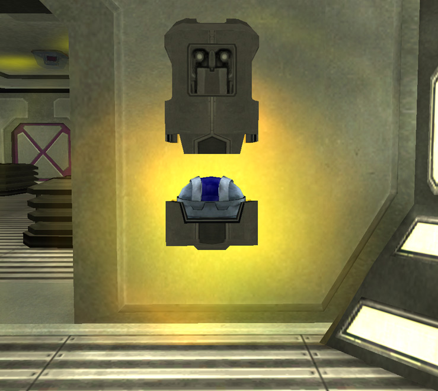

{ class="figure" }

The **Lattice Logic Unit Socket** is the Socket in which the
[LLU](../terminology/Lattice_Logic_Unit.md) (Lattice Logic Unit) will spawn
after the base is hacked.

The LLU will last 15 minutes, starting from the moment the
[facility](../locations/Facilities.md) is hacked until the LLU is successfully
brought to its destination or the defending [Empire](../terminology/Empire.md)
[re-hacks](../terminology/Hack.md) the facility.
