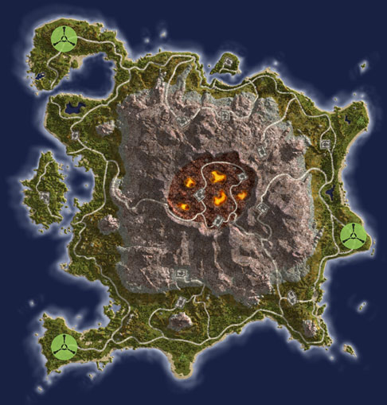

{ class="figure" }
{ class="figure" }

## Continental Data

|                                  |                                                                             |
| -------------------------------- | --------------------------------------------------------------------------- |
| Category:                        | Heavy Vulcanism                                                             |
| Climate:                         | Tropical                                                                    |
| Landmass:                        | Continent                                                                   |
| Terrain:                         | Volcanic pools, dusty craters, sheer cliffs, desolate plains, sunny beaches |
| [Facilities](Facilities.md):     | 14                                                                          |
| [Towers](Towers.md):             | 22                                                                          |
| Active [Warpgates](Warpgate.md): | 3                                                                           |
| Active [Geowarps](Geowarp.md):   | 1 (2 total, active gate cycles)                                             |
|                                  |                                                                             |

## Description

This world rages with storms. The moments when the weather is clear are
momentous as the volcanism that erupts around the world feeds belt after belt of
the fiercest storms imaginable. The [continent](Continent.md) of **Searhus**
seems sheltered in the center of a stable "eye" in the storms, but even the
peripheral storms felt here are severe by comparison elsewhere.

The center of this continent is a gigantic volcanic caldera. The bases inside
that crater are an obvious stronghold on the continent, but to keep those bases
secure, the facilities on the rim of the caldera should be secured as well.
Beware the lava pools! They are extremely unforgiving.

---

--source: Planetside In-game descriptions, pre- and
post-[Bending](../terminology/The_Bending.md).

## Base [Facilities](Facilities.md)

### [Amp Stations](Amp_Station.md)

- [Matagi](../facilities/Matagi.md)
- [Pele](../facilities/Pele.md)
- [Rehua](../facilities/Rehua.md)

### [Bio Laboratories](Bio_Laboratory.md)

- [Akua](../facilities/Akua.md)
- [Drakulu](../facilities/Drakulu.md)
- [Hiro](../facilities/Hiro.md)
- [Iva](../facilities/Iva.md)

### [Dropship Centers](Dropship_Center.md)

- [Sina](../facilities/Sina.md)

### [Interlink Facilities](Interlink.md)

- [Laka](../facilities/Laka.md)
- [Oro](../facilities/Oro.md)
- [Wakea](../facilities/Wakea.md)

### [Technology Plants](Technology_Plant.md)

- [Karihi](../facilities/Karihi.md)
- [Ngaru](../facilities/Ngaru.md)
- [Tara](../facilities/Tara.md)
