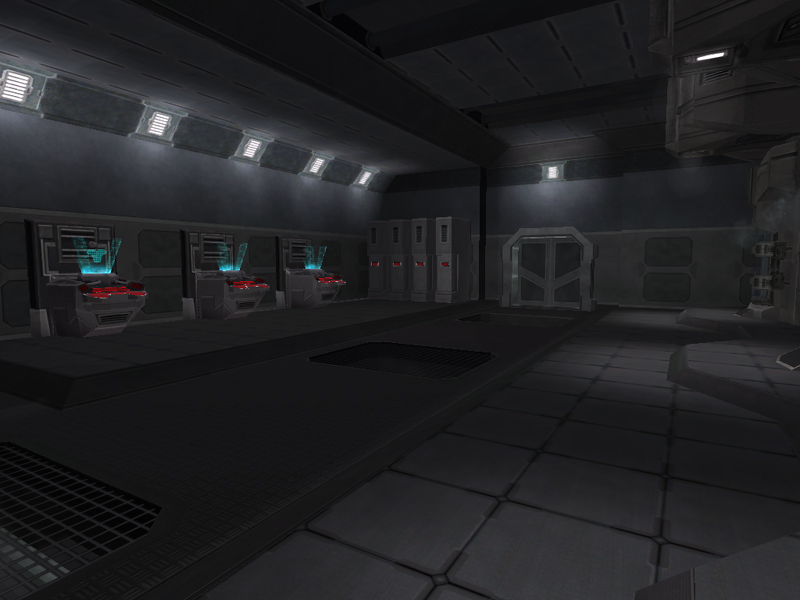

# Spawn Room

{ class="figure" }
{ class="figure" }
 [Redoubt Building](Redoubt_Building.md)](../images/CaveSpawnRoom.jpg){ class="figure" }

Room in [facilities](Facilities.md), [towers](Towers.md), or
the Sanctuary [Respawn Buildings](Respawn_Building.md) where the
[Respawn tubes](../items/Respawn_Tube.md) are located.

## Surface Spawn Rooms

In addition to the spawn tubes, these rooms come equipped with
several[lockers](../items/Lockers.md) and 3
[Equipment terminals](../items/Equipment_Terminal.md).

Respawn rooms are protected by low-energy
[Pain Fields](../terminology/Pain_Field.md). If a
[Pain Module](../modules/Pain_Module.md) is installed, this pain field is even more
lethal.

The Respawn room is adjacent to the [lounge](Lounge.md) and above the
[barracks](Barracks.md). These three areas together are sometimes refered to as
the Barracks as well.

## Cavern Spawn Rooms

Cavern Spawn Rooms work exactly like the surface ones, meaning that when you
die, you can select where to spawn, and you will spawn there when the timer is
done.

However, the Cave Spawn Rooms have no [Spawn Tubes](../items/Respawn_Tube.md),
and can therefor not be destroyed. The
[Ancient Equipment Terminals](../items/Ancient_Equipment_Terminal.md) in the
Spawn Rooms are also indestructable, making it harder to defend a
[Cavern](Caverns.md) [Facility](Facilities.md) because you cannot prevent the
Enemy from respawning and getting their gear. Cavern Spawn Rooms have a
[Pain Field](../terminology/Pain_Field.md) strength equal to that of a
[Pain Module](../modules/Pain_Module.md) by default.
