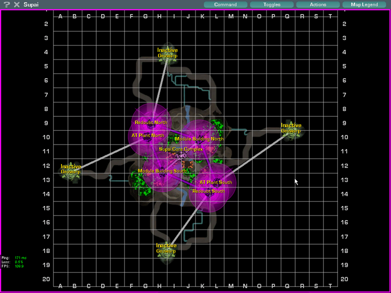

 Supai is one of the six [Core
Combat](../items/Core_Combat.md) [Caverns](Caverns.md).

Notable for the rapid river bisecting the floor and the gold-colored
crystal structures.

\]\]
 and
[Zipline](../items/Zipline.md) in Supai\]\]

The river is swift-moving, and walled in by steep banks, originating and
terminating with treacherous waterfalls. Just upstream of the final
waterfall is a ramp carved into the right bank, by which the lucky
bather may make an escape.

<!--[Category:Locations](Category:Locations.md)-->
