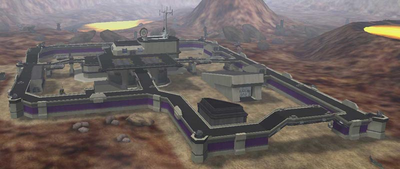

, [Esamir](Esamir.md)
as seen from above\]\]

## Base Facility Specs

|                                                                       |                                           |
| --------------------------------------------------------------------- | ----------------------------------------- |
| [Control Console](Control_Console.md):                                | Level 3                                   |
| [Generator](../items/Generator.md):                                   | Level 1                                   |
| [Spawn room](Spawn_Room.md):                                          | Level 2                                   |
| [Vehicle Terminal](Vehicle_Terminal.md) (Air):                        | Level 3                                   |
| [Vehicle Terminal](Vehicle_Terminal.md) (Ground):                     | Level 2                                   |
| [Lattice Logic Unit](../terminology/Lattice_Logic_Unit.md) Socket:    | Level 2                                   |
| [Facility Linked Benefit](../terminology/Facility_Linked_Benefit.md): | Advanced vehicles (benefit icon: vehicle) |
| [Wall Turrets](../items/Phalanx.md):                                  | 6                                         |
|                                                                       |                                           |

## Description

 Technology Plants are arguably
the most important type of [facility](Facilities.md) on a continent, as its
[base benefit](../terminology/Facility_Linked_Benefit.md) allows acquisition of
[Advanced Assault vehicles and aircraft](../vehicles/Advanced_Assault_vehicles.md).
Any facility linked to this base along a lattice will receive this powerful
benefit. Without it, Empires must purchase advanced vehicles from their
[Sanctuary](Sanctuary.md).

The [Control Console](Control_Console.md) for this base is on the top floor,
while the [LLU](../terminology/Lattice_Logic_Unit.md) Socket is located on Level
1 in the basement.

Another unique feature of Tech Plants, as they are called, is the
[Vehicle Terminals](Vehicle_Terminal.md) are located indoors. On the top floor
are two terminals for the Air Vehicle creation pads, and another on Level 2 for
the Ground Vehicle creation pad.

## Technology Plant Locations

### [Amerish](Amerish.md)

- [Heyoka](../facilities/Heyoka.md)
- [Mekala](../facilities/Mekala.md)
- [Tumas](../facilities/Tumas.md)

### [Ceryshen](Ceryshen.md)

- [Igaluk](../facilities/Igaluk.md)
- [Nerrivik](../facilities/Nerrivik.md) (Sub-Capitol)
- [Pinga](../facilities/Pinga.md)

### [Cyssor](Cyssor.md)

- [Faro](../facilities/Faro.md)
- [Leza](../facilities/Leza.md)
- [Orisha](../facilities/Orisha.md)
- [Wele](../facilities/Wele.md)

### [Esamir](Esamir.md)

- [Eisa](../facilities/Eisa.md) (Capitol)
- [Dagur](../facilities/Dagur.md)
- [Gjallar](../facilities/Gjallar.md)
- [Helheim](../facilities/Helheim.md)

### [Forseral](Forseral.md)

- [Anu](../facilities/Anu.md)
- [Gwydion](../facilities/Gwydion.md) (Sub-Capitol)

### [Hossin](Hossin.md)

- [Chac](../facilities/Chac.md)
- [Ghanon](../facilities/Ghanon.md)
- [Mulac](../facilities/Mulac.md)

### [Ishundar](Ishundar.md)

- [Baal](../facilities/Baal.md)
- [Girru](../facilities/Girru.md)
- [Kusag](../facilities/Kusag.md)
- [Marduk](../facilities/Marduk.md)

### [Oshur Battle Islands](Oshur.md)

- [Dahaka](../facilities/Dahaka.md)
- [Izha](../facilities/Izha.md)
- [Jamshid](../facilities/Jamshid.md)

### [Searhus](Searhus.md)

- [Karihi](../facilities/Karihi.md)
- [Ngaru](../facilities/Ngaru.md)
- [Tara](../facilities/Tara.md)

### [Solsar](Solsar.md)

- [Amun](../facilities/Amun.md) (Sub-Capitol)
- [Seth](../facilities/Seth.md)

<!--[Category:Locations](Category:Locations.md)-->
