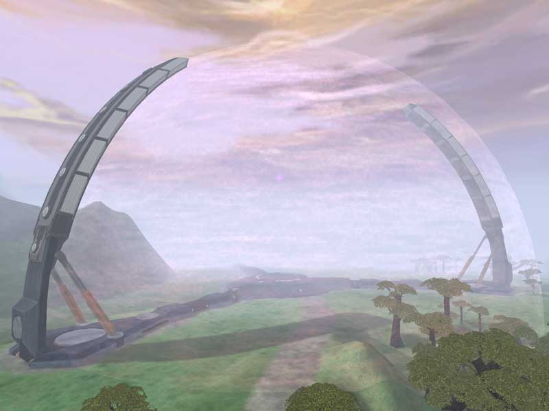

{ class="figure" }
{ class="figure" } A Warpgate is a gigantic,
hemispherically-shaped ancient artifact used to teleport individuals and
vehicles from one [continent](../locations/Continent.md) to another. There are 3 to 4
warpgates located on each continent and [sanctuary](../locations/Sanctuary.md), each linked
to a [planet](Planet.md) light years away.

If the warpgate's host continent is [locked](../etc/Continental_lock.md), or it
is linked to a locked continent via a
[continental lattice](../terminology/Lattice.md) chain, it becomes a
[Broadcast Warpgate (BWG)](../items/Broadcast_warpgate.md) and can transport an
individual across the [Galactic Lattice](../terminology/Galactic_Lattice.md) to
any planet in the lattice chain.

You cannot enter warpgates that link to an enemy [sanctuary](../locations/Sanctuary.md)
(found on enemy [Home Continents](Home_Continent.md)). These warpgates are
shaded the color of the controling empire on the
[Continental Map](../etc/Continental_Map.md). The bubble will act as a solid
structure for enemies (thus you cannot fill up an
[ANT](../vehicles/Advanced_Nanite_Transport.md) in these enemy warpgates).

Structurally, a warpgate consists of a large central platform, from which emits
a column of warp energy that shoots up and then encloses the entire construct
from top to bottom in a protective warp bubble. Three thick support bracings
extend outward from this central platform like spokes on a wheel, each an equal
distance from the other two. From these spokes curve upward and inward three
massive columns.

The warpgates are the land-based alternative to the
[High Altitute Rapid Transit Shuttle (HART)](../terminology/HART.md).

## Game Lore

The warpgates were the first Ancient artifacts discovered and inspected by the
Terran Republic expeditionary teams. It was the warp energy signatures passing
through the gates and along the [lattice](../terminology/Lattice.md) network
that the scientists were able to harness to create the weaponry, vehicles, and
equipment.

The warpgates were also the first source of human Re-birthing, later known as
[respawning](../terminology/Respawn.md). After a human passed through the
warpgate energy beam, he could no longer stay dead. Instead he would
[respawn](../terminology/Respawn.md) within one of the warpgates scattered
throughout the [Pre-Bending](../etc/The_Bending.md) planet of
[Auraxis](Auraxis.md).

The Terran scientists utilized this amazing property of the warpgates to create
the [Matrix Panels](../items/Matrix_Panel.md) and
[Respawn tubes](../items/Respawn_Tube.md) used in the various
[facilities](Facilities.md) on each [continent](../locations/Continent.md).

It is said that the scientists discovered how to create approximations of the
[Ancients](../terminology/Ancients.md)' vehicles and weaponry by studying the
warpgate energy.

Every day, the scientists and technicians of each
[Empire](../terminology/Empire.md) attempt to decipher the warpgate energy
patterns, testing ways to manipulate them for their own ends in order to
dominate the galaxy.

