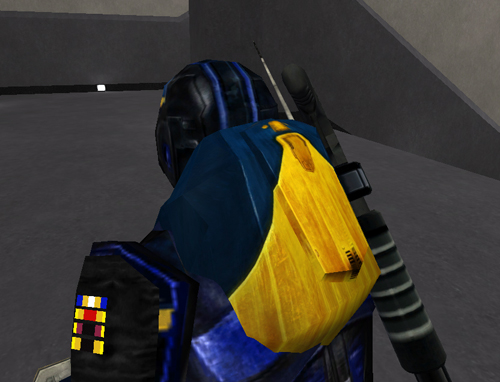

The term **backpack** can refer to several things:

 CR5's
[backpack](Backpack.md)\]\]

1. A character's [Inventory](Inventory.md).
2. The lootable pack that is left behind when a character dies and
   elects to [respawn](Respawn.md).
3. The armor upgrade associated with [Command Rank
   5](Command_Rank.md#Command_Rank_5_CR5) (see picture to the
   right).

<!--[category:Terminology](category:Terminology.md)-->
