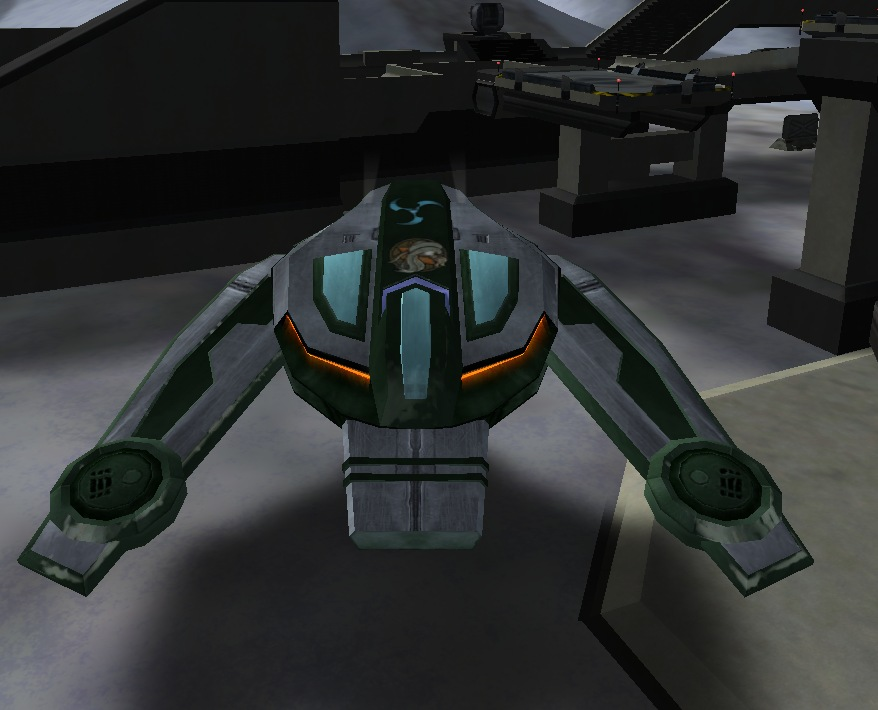

{ class="figure" } { class="figure" }
](../images/BO_Hacked_Facility.jpg){ class="figure" }

Black Ops (BO) are the Super Soldiers of [PlanetSide](../PlanetSide.md).
Having 1000 [Health](Health.md) and 500 [Stamina](Stamina.md) (which has a much
higher regeneration rate than normal) and having access to all
[certifications](../certifications/Certification.md), and therefor all
[vehicles](../vehicles/Vehicle.md) and [weaponry](../weapons/Weapon.md) they are
a force to be reckoned with. Black Ops soldiers can only chose between
[Agile Exo-Suit](../armor/Agile_Exo-Suit.md) and
[Reinforced Exo-Suit](../armor/Reinforced_Exo-Suit.md) and cannot choose
[MAX](../armor/Mechanized_Assault_Exo-Suit.md) armor. All vehicles are available
with greenish textures to denote Black Ops, though
[BFRs](../vehicles/BattleFrame_Robotics.md) are only available if enabled by a
GM. [One-Manned Field Turrets](../weapons/One-Manned_Field_Turret.md) deployed
by Black Ops will be the empire variant of the empire they left.

Black Ops do have certain restrictions/penalties however, as they cannot use any
[Implants](../implants/index.md) and are not awarded any form of Experience
Points for their activities. Kills made as a Black Ops also do not count towards
[Merit](../merits/index.md) progress or track on the
[PlanetSide](../PlanetSide.md) statistic websites.

Black Ops can only [Squad](Squad.md)/[Platoon](Platoon.md) together with other
Black Ops, and cannot use any [chat](../chat/In-Game_Chat.md) except for the
special Black Ops chat (/b <message> or /c <message> when playing as a Black
Ops) and Squad/Platoon Chat.

Black Ops can only be on the continent(s) enabled by the GM (usually only one),
as all others will be locked to them. By using the Black Ops HQ they can
instantly [HART](HART.md) drop anywhere on the
[continent](../locations/Continent.md), as well as spawn at any neutral
[Facility](../locations/Facilities.md) or [Tower](../locations/Towers.md) on
that continent. In addition, they can spawn at
[AMSes](../vehicles/Advanced_Mobile_Station.md) that are placed by other Black
Ops.

Towers will go neutral the moment they are hacked by a Black Ops, Facilities
have a 5 minute timer before they flip. Black Ops can only own or have a hack on
a maximum of 3 bases, but there is no limit on the number of towers they can
own.

Note that even though all cosmetic [Command Rank](Command_Rank.md) attributes
like the CR5 [backpack](Backpack.md) disappear when being turned into a Black
Ops, they will still keep the Command abilities
([Orbital Strike](../terminology/Orbital_Strike.md), [EMP](../terminology/EMP.md),
Reveal Enemies and Reveal Friendliess) they have as a normal soldier.

When transformed into a Black Ops, the player will receive the
[Black Ops Mercenary](../merits/Black_Ops_Mercenary.md) Merit Commendation.

[VS](Vanu_Sovereignty.md), [TR](Terran_Republic.md) and
[NC](New_Conglomerate.md) Soldiers that kill a Black Ops will be awarded
with the [Black Ops Hunter](../merits/Black_Ops_Hunter.md) Merit Commendations.
