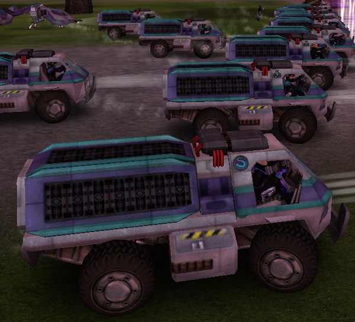

{ class="figure" } { class="figure" }

|                            |                                              |
| -------------------------- | -------------------------------------------- |
| **Type**                   | Utility                                      |
| **Role**                   | Resource Gathering                           |
| **Certification Required** | None                                         |
| **Empire**                 | [Common Pool](../terminology/Common_Pool.md) |
| **Primary Weapon**         | \-                                           |
| **Secondary Weapon**       | \-                                           |
| **Occupants**              | 1 (Driver)                                   |
| **Handling**               | Very Poor                                    |
| **Top speed**              | 61 kph                                       |

**Advanced Nanite Transport (ANT)**

The **Advanced Nanite Transport (ANT)** is used to resupply
[facilities](../locations/Facilities.md) with [NTUs](../items/NTU.md).

To do so, the driver must first drive into a
[Warpgate](../locations/Warpgate.md) or [Geowarp](../locations/Geowarp.md)
bubble and deploy the **ANT**. (Default key mapping is 'B'.) Note: If harvesting
from a [Geowarp](../locations/Geowarp.md), that Geowarp must be active at the
time.

When the **ANT's** capacitors are full, it will automatically undeploy. The
driver must travel to a facility and deploy the **ANT** near the
[NTU Silo](../locations/NTU_Silo.md). The **ANT** will undeploy automatically
when the [NTU Silo](../locations/NTU_Silo.md) is full or the **ANT's**
capacitors are empty.

One fully-filled **ANT** carries approximately 150% of one
[facility](../locations/Facilities.md)'s total [NTU](../items/NTU.md) capacity.

Caution: Fully-charged **ANTs** have a significant secondary blast radius when
destroyed.
