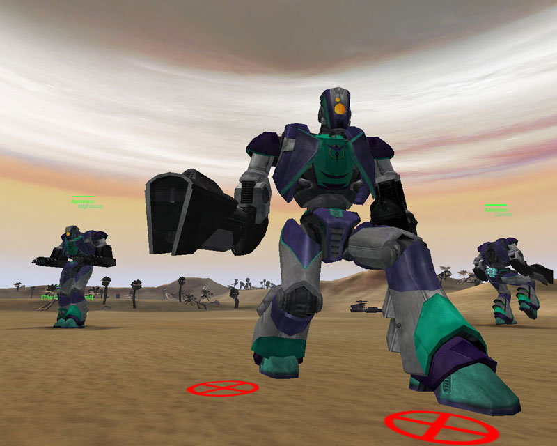

](../images/AphelionPicture.jpg){ class="figure" }

The Aphelion is the gunner variant of
[BattleFrame Robotics](BattleFrame_Robotics.md) developed by the
[Vanu Sovereignty](../terminology/Vanu_Sovereignty.md). While lacking the engagement
range of the [Colossus](Colossus.md) and [Peregrine](Peregrine.md), the Aphelion
can pack a punch if an enemy gets too close. Many players complain of getting
"sea sick" in the gunner's pod, as it shakes more violently than the other
empires' BFRs when running.

Gunner variants have, in addition the the pilot weapons, an extra gunner pod on
their backs where a second soldier can mount a secondary gun mounted atop the
BFR. They also have more armor and a faster shield regeneration then their
flight counter parts giving them more of a "staying power."

The Flight Variant of the Aphelion is the [Eclipse](Eclipse.md).

## Pilot Weapons

The Pilot Weapons that the Aphelion can obtain are

- The [Continuous Laser](../weapons/Continuous_Laser.md) (Anti-Infantry)
- The
  [Pulsed Particle Accelerator](<../items/Pulsed_Particle_Accelerator_(BFR).md>)
  (Anti-Vehicular)
- The [Starfire](<../items/Starfire_(BFR).md>) (Anti-Aircraft)
- The [NTU Siphon](../weapons/NTU_Siphon.md)
- The [Armor Siphon](../weapons/Armor_Siphon.md) (Anti-Vehicular)

The pilot has room for two such weapons at a time and can be two of the same
weapon, or two different weapons.

## Gunner Weapons

The gunner weapons available to the Aphelion are

- The [Immolation Cannon](../weapons/Immolation_Cannon.md) (Anti-Vehicular)
- The[Plasma Mortars](../weapons/Plasma_Mortar.md) (Anti-Infantry)

Only one gunner weapon can be used at a time.

## History

{ class="figure" } The currently-fielded unit named
"Aphelion" varies from the pictured unit. When introduced, the two-man version
of the [VS](../terminology/Vanu_Sovereignty.md) battleframe was named the **Orion**. It
was renamed "Aphelion" in patch [3.2.6](../patches/3.2.6.md), and the original
one-man Aphelion retired from service.
