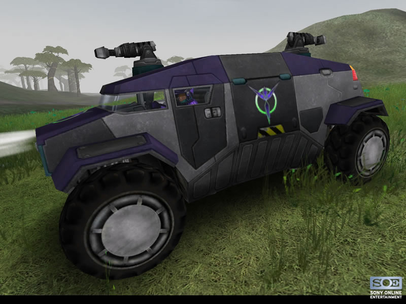

 Aurora\]\]

|                            |                                                           |
| -------------------------- | --------------------------------------------------------- |
| **Type**                   | Medium Transport                                          |
| **Role**                   | Medium Troop Transport                                    |
| **Certification Required** | [Ground Transport](../certifications/Ground_Transport.md) |
| **Empire**                 | [Vanu Sovereignty](../etc/Vanu_Sovereignty.md)            |
| **Primary Weapon**         | 2 [Flux Pods](../items/Flux_Pod.md)                       |
| **Secondary Weapon**       | \-                                                        |
| **Occupants**              | 5 (Driver, 2 Gunners and 2 Passengers)                    |
| **Handling**               | Good                                                      |
| **Top speed**              | 63 kph (40 kph over water)                                |

**Aurora**

The Aurora variant developed by the [Vanu
Sovereignty](../etc/Vanu_Sovereignty.md) is equipped with [Flux
Pod](../items/Flux_Pod.md) Launchers, similar in effect to the [Flux
Cannon](../weapons/Flux_Cannon.md) with an indirect arc of fire. A
secondary fire mode launches a salvo of 6-pods in rapid succession with
a large [cone of fire](cone_of_fire.md) that rains destruction
on the enemy. Each clip holds 12 pods, thus one must reload often. Best
used against infantry, but effective against other
[vehicles](Vehicle.md)/armor at close range. Due to the arc of
fire, we suggest you avoid upclose encounters. Like the
[Deliverer](Deliverer.md), the Aurora has adequate
[trunk](../terminology/Trunk.md) space and can cross calm rivers and waterways
by floating at the surface.

**Introduced: May 27, 2004 with update version
[2.7.6](2.md.7.6).**

[Category:Game Items](../Category:Game_Items.md)
[Category:Vehicles](../Category:Vehicles.md) [Category:Vanu
Sovereignty Vehicles](../Category:Vanu_Sovereignty_Vehicles.md)
[Category:Ground Vehicles](../Category:Ground_Vehicles.md)
