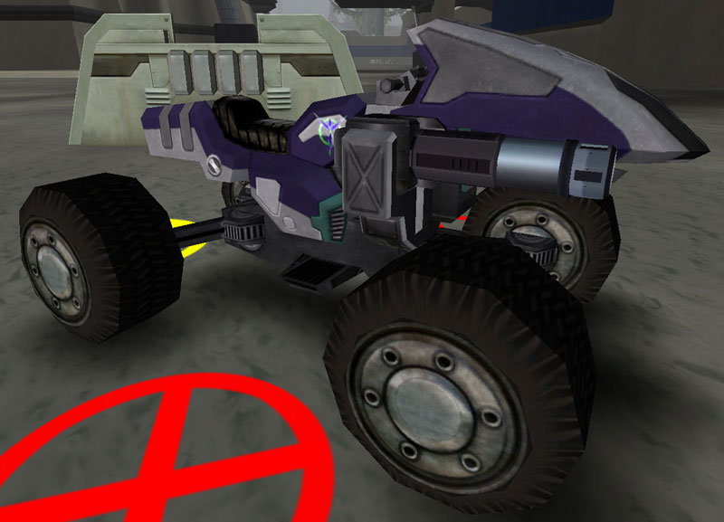

 Fury\]\]

|                            |                                                               |
| -------------------------- | ------------------------------------------------------------- |
| **Type**                   | ATV                                                           |
| **Role**                   | Rapid Response/Escort                                         |
| **Certification Required** | [ATV](<ATV_(Certification)>)                                  |
| **Empire**                 | [Common Pool](../terminology/Common_Pool.md)                  |
| **Primary Weapon**         | Hellfire Rocket Launcher                                      |
| **Secondary Weapon**       | \-                                                            |
| **Ammunition Used**        | [Hellfire Rocket Pack](../ammunition/Hellfire_Rocket_Pack.md) |
| **Range**                  | 200m                                                          |
| **Occupants**              | 1 (Driver)                                                    |
| **Handling**               | Ultra Nimble                                                  |
| **Top speed**              | 88 kph                                                        |

**Fury**

The **Fury** is a fast all terrain vehicle ([ATV](ATV.md)) with
a single side mounted two shot **Hellfire** rocket system. This weaponry
makes the Fury one of the most feared objects on a battlefield, known to
take down a full health Flight-Variant [BFR](BattleFrame_Robotics.md) in just
sixteen direct hits, the fastest Time To Kill (TTK) of any vehicle
mounted weapons system. However, the [ATV](ATV.md) chassis is a
very vulnerable system, with only a few hundred armor points, almost
anything can kill an ATV. The ATV in general is capable of cruise speeds
over flat ground of 88kph and has been known to reach uncontrollable
speeds of 212kph.

The other ATV variants are the [Basilisk](Basilisk.md) and the
[Wraith](Wraith.md)

[Category:Game Items](Category:Game_Items.md)
[Category:Vehicles](Category:Vehicles.md) [Category:Common Pool
Vehicles](Category:Common_Pool_Vehicles.md)
