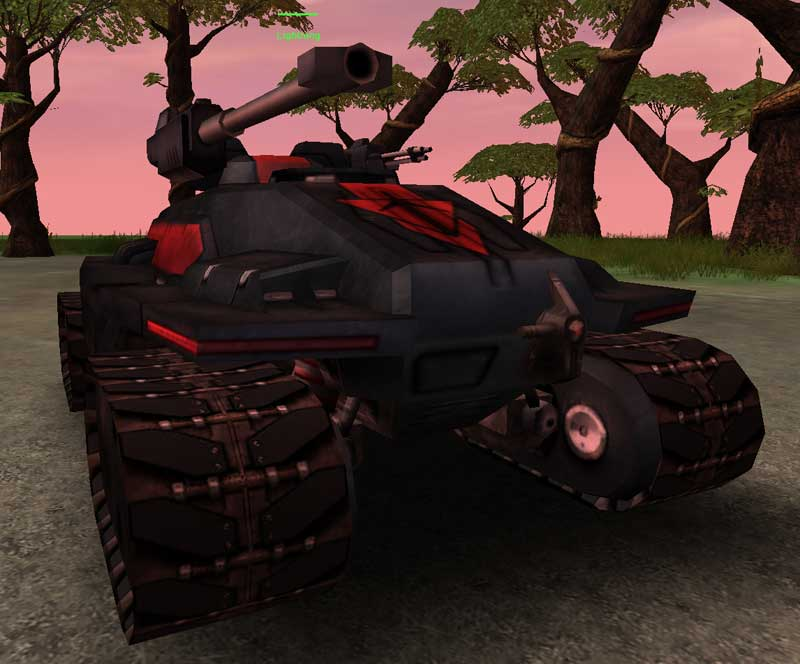

 Lightning\]\]

|                            |                                                                                                 |
| -------------------------- | ----------------------------------------------------------------------------------------------- |
| **Type**                   | Light Tank                                                                                      |
| **Role**                   | Attack/Escort                                                                                   |
| **Certification Required** | [Armored Assault I](../certifications/Armored_Assault_I.md)                                                       |
| **Empire**                 | [Common Pool](../terminology/Common_Pool.md)                                                                   |
| **Primary Weapon**         | 75mm Cannon                                                                                     |
| **Secondary Weapon**       | 12mm Rotary Chaingun                                                                            |
| **Ammunition Used**        | [Lightning Shell](../ammunition/Lightning_Shell.md) and [Rotary Chaingun Bullets](../ammunition/Rotary_Chaingun_Bullets.md) |
| **Occupants**              | 1 (Driver)                                                                                      |
| **Handling**               | Good                                                                                            |
| **Top speed**              | 75 kph                                                                                          |

**Lightning**

The Lightning light tank is used by all three Empires. It has the least
armor, smallest profile and highest speed. It lacks the firepower and
armor to engage a medium tank. Instead it can be used for drive-by
shooting or as light artillery. A Lightning can be transported by the
[Galaxy dropship](Galaxy.md).

Shots to kill (with 75mm Cannon only):

|                           |          |
| ------------------------- | -------- |
| [Lightning](Lightning.md) | 14 shots |
| [Prowler](Prowler.md)     | 36 shots |
| [Magrider](../Magrider.md)   | 28 shots |
| [Vanguard](Vanguard.md)   | 36 shots |

(The above numbers are taken with full Armor; no Vehicle Shields
applied)

[Category:Game Items](Category:Game_Items.md)
[Category:Vehicles](Category:Vehicles.md) [Category:Common Pool
Vehicles](Category:Common_Pool_Vehicles.md)
