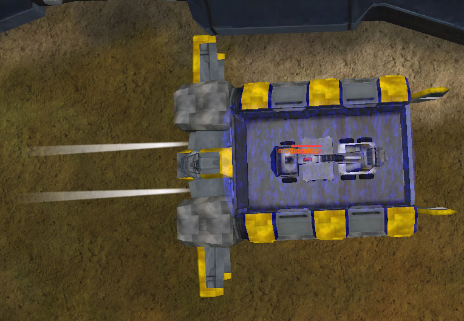

|                            |                                                                    |
| -------------------------- | ------------------------------------------------------------------ |
| **Type**                   | Vehicle Transport                                                  |
| **Role**                   | Vehicle Transport/Mobile Repair                                    |
| **Certification Required** | [Air Support](../certifications/Air_Support.md)                    |
| **Empire**                 | [Common Pool](../terminology/Common_Pool.md)                       |
| **Primary Weapon**         | \-                                                                 |
| **Secondary Weapon**       | \-                                                                 |
| **Occupants**              | 1 (Pilot)                                                          |
| **Handling**               | Very Poor                                                          |
| **Top speed**              | 79 kph (150 kph with [Afterburner](../terminology/Afterburner.md)) |

**Lodestar**

 Lodestar carries an
[AMS](Advanced_Mobile_Station.md)\]\] The **Lodestar** is a massive, shoebox
shaped aircraft designed to carry any vehicle and also act as a remote
Repair/rearm.md station. Infantry may not be directly transported by the
Lodestar, but must be inside a vehicle.

Extremely poor maneuverability, a gigantic profile, and a complete lack of
weaponry leave the Lodestar with only its impressive armor as means for
survival, although the Lodestar does have an
[Afterburner](../terminology/Afterburner.md).

Vehicles in transit may Hotdrop in a similar manner to infantry in a
[Galaxy](Galaxy.md), (Default 'Alt-G') but must take extra care to ensure the
landing area is flat and driveable. Vehicles landing on rooftops, walls,
walkways and railings face massive damage and desconstruction.

Vehicles being carried by the Lodestar are protected by an energy field,
rendering them immune to damage. However, they may not shoot out of the field,
and will be destroyed with the Lodestar if still aboard.

When landed, the Lodestar provides a mobile Repair/rearm.md station. Friendly
vehicles simply drive (or hover) close to the Lodestar and they are
autorepaired. They can also rearm their vehicle in the same way as can be done
at the base's [Repair/Rearm.md Silo](../items/Repair_Rearm_Silo.md), making them
very valuable for attacks on distant enemy bases. By piloting the lodestar and
assisting others in this way, one can earn the
[Lodestar Support](../merits/Lodestar_Support.md) merits.

The [Lodestar](Lodestar.md) can only be purchased at a
[Dropship Center](../locations/Dropship_Center.md) or in the
[Sanctuary](../locations/Sanctuary.md) and requires the
[Air Support](../certifications/Air_Support.md)
[certification](../certifications/Certifications.md).

The Lodestar's apparent namesake is the
[Lockheed Lodestar](http://en.wikipedia.org/wiki/Lockheed_Lodestar)

<!--[Category:Game Items](Category:Game_Items.md)-->
<!--[Category:Vehicles](Category:Vehicles.md)--> [Category:Common Pool

Vehicles](Category:Common_Pool_Vehicles.md)
[Category:Air Vehicles](Category:Air_Vehicles.md)
