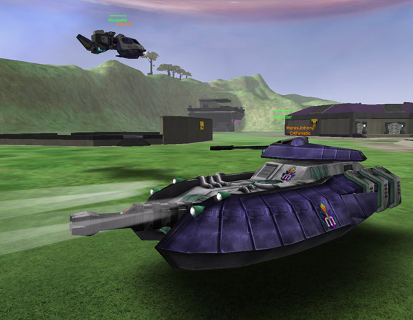

# Magrider

|                            |                                                                                                                            |
| -------------------------- | -------------------------------------------------------------------------------------------------------------------------- |
| **Type**                   | [Medium Battle Tank](../items/Medium_Battle_Tank.md)                                                                       |
| **Role**                   | Attack                                                                                                                     |
| **Certification Required** | [Armored Assault I](../certifications/Armored_Assault_I.md) and [Armored Assault II](../certifications/Armored_Assault_II.md) |
| **Empire**                 | [Vanu Sovereignty](../factions/Vanu_Sovereignty.md)                                                                             |
| **Primary Weapon**         | Heavy Rail Beam                                                                                                            |
| **Secondary Weapon**       | Pulsed Particle Accelerator                                                                                                |
| **Ammunition Used**        | [PPA Battery](../items/PPA_Battery.md) and [Rail Beam Battery](../ammunition/Rail_Beam_Battery.md)                         |
| **Range**                  | PPA: 200m Heavy Rail Beam: 300m                                                                                            |
| **Occupants**              | 2 (Driver and Gunner)                                                                                                      |
| **Handling**               | Good                                                                                                                       |
| **Top speed**              | 65 kph (45 kph over water)                                                                                                 |

**Magrider**

The Magrider is the [Vanu Sovereignty](../factions/Vanu_Sovereignty.md)'s medium
battle tank (MBT). Unique because of its non-tracked drive, the Magrider floats
above the ground, enabling the vehicle to travel over water and strafe. It can
be agile even when traversing rough terrain. The Magrider is the fastest of all
MBTs, with a top speed of 67-68kph. \[This speed is achived by driving the
vehicle at an angle while strafing and moving forward.\]

The primary weapon of the Magrider is the heavy rail beam. Capable of direct
line-of-sight fire, it is an (almost) pinpoint accurate weapon. The gun has very
little splash damage, and requires multiple hits to kill a reasonably armored
trooper. It is also the weakest gun of the MBTs, but the long range of the gun
means that the Magrider can engage enemies before they can respond. The Magrider
is also the only MBT armed with a driver weapon, the pulsed particle
accelerator. The Magrider may NOT be driven while wearing the
[Reinforced Exo-Suit](../armor/Reinforced_Exo-Suit.md).

The Magrider requires a [Technology Plant](../locations/Technology_Plant.md)
lattice link or [Sanctuary](../locations/Sanctuary.md) vehicle pad in order to
be purchasable.

Shots to kill (with Heavy Rail Beam only):

|                           |          |
| ------------------------- | -------- |
| [Lightning](Lightning.md) | 8 shots  |
| [Prowler](Prowler.md)     | 21 shots |
| [Vanguard](Vanguard.md)   | 21 shots |

(The above numbers are taken with full Armor; no Vehicle Shields applied)

<H3>

Tactics

</H3>

- [Magrider Guide by Quovatis](../archive/strategy/Magrider_Guide_by_Quovatis.md)
