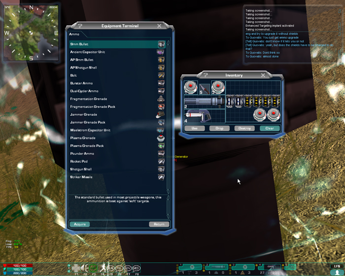

|                            |                                                                                                                                      |
| -------------------------- | ------------------------------------------------------------------------------------------------------------------------------------ |
| **Certification Required** | [Assault Engineering](../certifications/Assault_Engineering.md) or [Advanced Engineering](../certifications/Advanced_Engineering.md) |
| **Empire**                 | [Common Pool](../terminology/Common_Pool.md)                                                                                         |
| **Primary Mode**           | Deploy Shield Generator                                                                                                              |
| **Secondary Mode**         | \-                                                                                                                                   |
| **Ammunition**             | 1 [Field Deployment Unit](Field_Deployment_Unit.md)                                                                                  |
| **Inventory Dimensions**   | 3 x 9 (Rifle Holster)                                                                                                                |
| **Magazine Capacity**      | 1 per unit                                                                                                                           |
| **Zoom**                   | \-                                                                                                                                   |

**Aegis Shield Generator**

The Aegis Shield Generator is similar to the Cloaking bubble of an
[Advanced Mobile Station](../vehicles/Advanced_Mobile_Station.md), as it hides
anything inside of its bubble from sight.
[Fortification Engineers](../certifications/Fortification_Engineering.md) can
upgrade the Aegis to have a shield by repairing it with a
[Nano Dispenser](Nano_Dispenser.md) (normal ammunition). A fully upgraded shield
provides roughly the equivalent of a [Phalanx](../items/Phalanx.md) Wall Turret
worth of armor protection. Aegis Shield work rather similar to the one gained by
a [Shield Module](../items/Shield_Module.md). They block all fire, both enemy
and friendly, as well as enemy [vehicles](../vehicles/Vehicle.md). Note that
friendly fire at the shield will reduce the Shield's power.

The Aegis Shield Generator can also be upgraded by
[Assault Engineers](../certifications/Assault_Engineering.md) with ammunition
benefits. This benefit eventually wears off and will need to be re-upgraded
periodically. The status of the Aegis can be seen by double clicking on the
Aegis deployable icon on the [Continental Map](../etc/Continental_Map.md). Note
that if a character has both Fortification and Assault Engineering (or
[Advanced Engineering](../certifications/Advanced_Engineering.md)), upgrading
the shields takes priority, and thus to upgrade to ammunition benefits, the
shield must first be at full strength.

[Assault Engineers](../certifications/Assault_Engineering.md) can only place 1
Aegis Shield Generator at any given time. As with all the other Deployables, if
the Engineer tries to deploy a second one, the first one will deconstruct. Note
however, that friendlies might be using your Shield Generator as cover, and will
be exposed to enemy fire if you deconstruct it!

The interference range of the Aegis is the same as that of an
[AMS](../vehicles/Advanced_Mobile_Station.md). The Aegis shares the same
interference ranges as the
[Tactical Resonance Area Protection (TRAP)](Tactical_Resonance_Area_Protection.md)
and the [One-Manned Field Turrets](One-Manned_Field_Turret.md).

Soldiers certified in [Data Corruption](../certifications/Data_Corruption.md) or
[Electronics Expert](../certifications/Electronics_Expert.md) can use their
[T-REK](T-REK.md) to infect enemy Aegis shields with a
[Virus](../terminology/Virus.md). This virus causes the Aegis to emit a
[Pain Field](../terminology/Pain_Field.md), harming any friendly unit inside its
bubble.

[Expert Hackers](../certifications/Expert_Hacking.md) or
[Electronics Experts](../certifications/Electronics_Expert.md) can remove an
enemy virus from the Aegis and also use their [REK](Remote_Electronics_Kit.md)
to hack a friendly Aegis to provide a short-ranged
[Interlink](../terminology/Interlink.md) benefit around it for friendly units.
However, the radar is only active for friendly units that are inside the
cloaking sphere of the Aegis. Like the ammunition upgrade, the radar eventually
wears off over time and will need to be re-upgraded for continual use.

<!--[Category:Weapons](../Category:Weapons.md)-->
