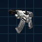

# Automatic Machine Pistol

{ class="figure" }

|                            |                                                                                                                       |
| -------------------------- | --------------------------------------------------------------------------------------------------------------------- |
| **Certification Required** | [Standard Assault](../certifications/Standard_Assault.md)                                                             |
| **Empire**                 | [Common Pool](../terminology/Common_Pool.md)                                                                          |
| **Primary Mode**           | Machine Pistol                                                                                                        |
| **Secondary Mode**         | \-                                                                                                                    |
| **Ammunition**             | 9mm Bullets ([Standard](../ammunition/9mm_Bullet.md) or [Armor Piercing](../ammunition/Armor_Piercing_9mm_Bullet.md)) |
| **Range**                  | 200m                                                                                                                  |
| **Inventory Dimensions**   | 3 x 3 (Pistol Holster)                                                                                                |
| **Magazine Capacity**      | 30                                                                                                                    |
| **Zoom**                   | x2                                                                                                                    |

**Automatic Machine Pistol (AMP)**

 Capable of utilizing either
Anti-Infantry or Armor-Piercing ammunition, the
[AMP](Automatic_Machine_Pistol.md) is the only fully-automatic handgun
available.

This pistol is very effective at close range firing long bursts, but the extreme
cone of fire bloom means that it is unreliable past about 5m in full-auto.

Firing steady, single shots, the [AMP](Automatic_Machine_Pistol.md) is accurate
enough to finish off very wounded troops from a medium, safe distance.

Shots to kill:

|                                                        |                                                 |
| ------------------------------------------------------ | ----------------------------------------------- |
| [Standard Exo-Suit](../armor/Standard_Exo-Suit.md)     | 8 shots                                         |
| [Agile Exo-Suit](../armor/Agile_Exo-Suit.md)           | 9 shots                                         |
| [Reinforced Exo-Suit](../armor/Reinforced_Exo-Suit.md) | 13 shots                                        |
| [MAX](../armor/Mechanized_Assault_Exo-Suit.md)         | 58 [AP](../terminology/Armor_Piercing.md) shots |
