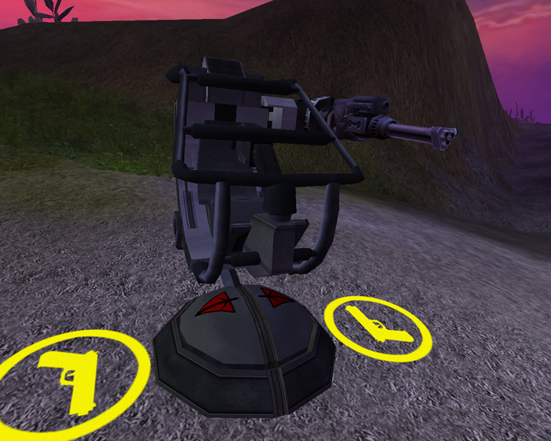

{ class="figure" } { class="figure" }

|                            |                                                                                                                                      |
| -------------------------- | ------------------------------------------------------------------------------------------------------------------------------------ |
| **Certification Required** | [Assault Engineering](../certifications/Assault_Engineering.md) or [Advanced_Engineering](../certifications/Advanced_Engineering.md)) |
| **Empire**                 | [Terran Republic](../terminology/Terran_Republic.md)                                                                                         |
| **Primary Mode**           | Upgraded Cycler                                                                                                                      |
| **Secondary Mode**         | \-                                                                                                                                   |
| **Ammunition**             | Unlimited                                                                                                                            |
| **Inventory Dimensions**   | 3 x 9 (Rifle holster)                                                                                                                |
| **Magazine Capacity**      | 200                                                                                                                                  |
| **Range**                  | 250m                                                                                                                                 |
| **Zoom**                   | 4x                                                                                                                                   |

**Avenger**

The [Terran Republic](../terminology/Terran_Republic.md) Variant of the
[One-Manned Field Turrets](One-Manned_Field_Turret.md), and is deployed by use
of the [Field Deployment Unit](Field_Deployment_Unit.md). It is an adaptation of
the [Dual Cycler](../armor/Dual-Cycler.md)
[MAX](../armor/Mechanized_Assault_Exo-Suit.md) weapon. The rate of fire is
similar to a locked-down Dual Cycler MAX. It has unlimited ammunition, though it
does have to reload after its clip has been depleted.
