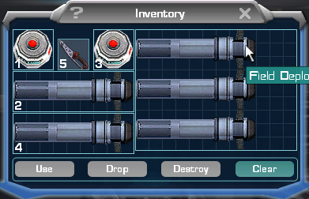
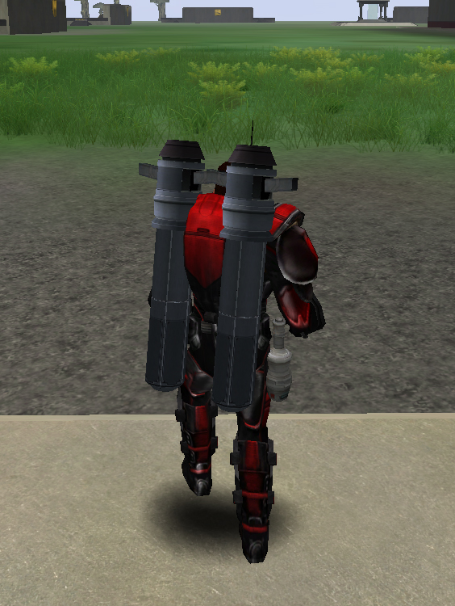

|                            |                                                                                                                                                                                                                     |
| -------------------------- | ------------------------------------------------------------------------------------------------------------------------------------------------------------------------------------------------------------------- |
| **Certification Required** | [Assault Engineering](../certifications/Assault_Engineering.md) or [Fortification Engineering](../certifications/Fortification_Engineering.md) or [Advanced Engineering](../certifications/Advanced_Engineering.md) |
| **Empire**                 | [Common Pool](../terminology/Common_Pool.md)                                                                                                                                                                        |
| **Primary Mode**           | Deploy [TRAP](Tactical_Resonance_Area_Protection.md) (Fortification Engineering)                                                                                                                                    |
| **Secondary Mode**         | Deploy [One-Manned Field Turret](One-Manned_Field_Turret.md) (Assault Engineering)                                                                                                                                  |
| **Tertiary Mode**          | Deploy [Aegis Shield Generator](Aegis_Shield_Generator.md) (Assault Engineering)                                                                                                                                    |
| **Ammunition**             | Field Deployment Unit                                                                                                                                                                                               |
| **Inventory Dimensions**   | 3 x 9 (Rifle holster)                                                                                                                                                                                               |
| **Magazine Capacity**      | 1                                                                                                                                                                                                                   |
| **Zoom**                   | None                                                                                                                                                                                                                |

**Field Deployment Unit (FDU)**

The FDU is required to deploy the
[TRAP](Tactical_Resonance_Area_Protection.md) for the
[Fortification Engineers](../certifications/Fortification_Engineering.md), and
[Aegis Shield Generator](Aegis_Shield_Generator.md) and
[One-Manned Field Turrets](One-Manned_Field_Turret.md) for the
[Assault Engineers](../certifications/Assault_Engineering.md).

It is as big as the largest Rifle in your
[inventory](../terminology/Inventory.md), and is consumed when used to deploy
something.

Like [ACE](Adaptive_Construction_Engine.md) devices, the FDU devices owned by you show as
a different color in the gameworld and on the [Continental
Map](../etc/Continental_Map.md). They can also be deconstructed by
double clicking on their icon on the continental map and selecting to
deconstruct them.

 Soldier carrying 2 FDU's\]\]

[Category:Weapons](Category:Weapons.md)
