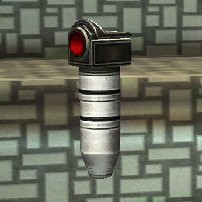

# Jammer Grenade

{ class="figure" }

|                            |                                                           |
| -------------------------- | --------------------------------------------------------- |
| **Certification Required** | [Standard Assault](../certifications/Standard_Assault.md) |
| **Empire**                 | [Common Pool](../terminology/Common_Pool.md)              |
| **Primary Mode**           | Explode on Contact                                        |
| **Secondary Mode**         | Three Second Fuse                                         |
| **Ammunition**             | \-                                                        |
| **Inventory Dimensions**   | 2 x 2 (Pistol Holster)                                    |
| **Magazine Capacity**      | 3                                                         |
| **Zoom**                   | None                                                      |

**Jammer Grenade**

**Jammer grenades** cause electomagnetic interference explosions. This
interference has the following effects:

- Causes soldier [implant timers](../implants/index.md) to reset.
- Causes the following to cease functioning for a short time:
  - [Proximity Map](../terminology/Proximity_Map.md) radar.
  - Vehicle weapons (except [BFRs](../vehicles/BattleFrame_Robotics.md))
  - [Spitfire](Adaptive_Construction_Engine.md#spitfire-turret),
    [Cerberus](Cerberus_Turret.md), [Shadow](Shadow_Turret.md),
    [Phalanx](../items/Phalanx.md), [OMFT](One-Manned_Field_Turret.md) and
    manned [Ancient Sentry Turrets](../items/Ancient_Sentry_Turret.md).
  - [Motion Sensors](Adaptive_Construction_Engine.md#motion-sensor-alarm) and
    [Sensor Disruptors](../items/Sensor_Disruptor.md).
- Causes
  [High Explosive Mines](Adaptive_Construction_Engine.md#high-explosive-mine),
  [Disruptor Mines](Disruptor_Mine.md), and
  [Boomers](Adaptive_Construction_Engine.md#remote-detonated-charge-boomer) to
  detonate.
- Causes deployed [Aegis Shield Generators](Aegis_Shield_Generator.md) and
  [AMSes](../vehicles/Advanced_Mobile_Station.md) to temporarily decloak.
- Disrupts BFR systems:
  - Slows servos for all frame movements
  - Decreases weapon refire rate
  - Disables [Armor Siphon](Armor_Siphon.md) and [NTU Siphon](NTU_Siphon.md)
    functionality
  - Takes flight systems offline
  - Slows shield regeneration significantly

In addition to the [Hand grenade](Hand_grenade.md) three-pack, **Jammer
grenades** are also available in ammo boxes for use with the
[Thumper](Thumper.md) and [Punisher](Punisher.md).
