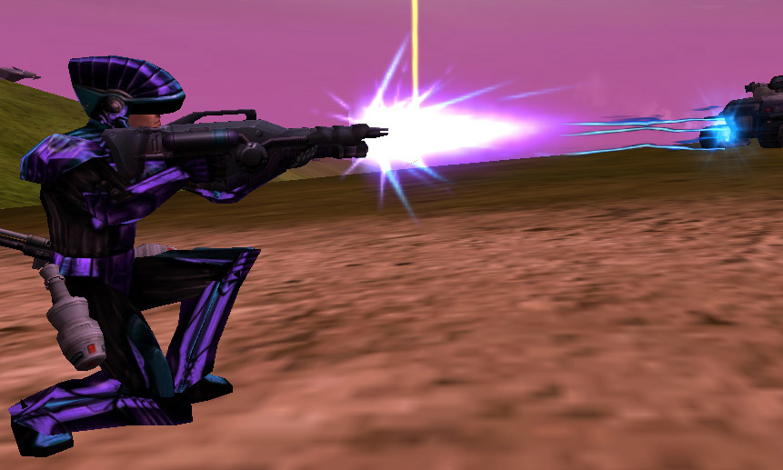

{ class="figure" }

|                            |                                                        |
| -------------------------- | ------------------------------------------------------ |
| **Certification Required** | [Heavy Assault](../certifications/Heavy_Assault.md)    |
| **Empire**                 | [Vanu Sovereignty](../terminology/Vanu_Sovereignty.md)         |
| **Primary Mode**           | Energy Orb                                             |
| **Secondary Mode**         | [Armor Piercing](../terminology/Armor_Piercing.md) Orb |
| **Ammunition**             | [Energy Cells](../ammunition/Energy_Cell.md)           |
| **Range**                  | 90m                                                    |
| **Inventory Dimensions**   | 3 x 9 (Rifle Holster)                                  |
| **Magazine Capacity**      | 35                                                     |
| **Zoom**                   | 2x                                                     |

**Lasher**

The [Lasher](Lasher.md) is the
[Heavy Assault](../certifications/Heavy_Assault.md) weapon of the
[Vanu Sovereignty](../terminology/Vanu_Sovereignty.md). It quickly fires energy orbs
which do significant damage on contact, as well as "Lashing" (When an orb
brushes by the target) nearby enemy targets for minor damage. The orbs travel
fairly quickly (as of patch [3.15.29](../patches/3.15.29.md)) but suffer from
[damage degradation](../terminology/Damage_Degradation.md) at longer ranges.
Enemies closer than 5 meters from the shooter will not be lashed by near misses.
Friendly units are immune to the lash effect at all ranges, though they will
still take damage upon direct hits. The near miss lash does low damage on its
own and is best used for discovering [cloakers](../armor/Infiltration_Suit.md)
and making the enemy's [COF](../terminology/Cone_of_fire.md) bloom from the
damage. However, it is still strong enough to make many enemies retreat if they
are hiding behind a wall and is especially effective in groups of users.

The secondary [Armor Piercing](../terminology/Armor_Piercing.md) fire mode is
best used against [MAXes](../armor/Mechanized_Assault_Exo-Suit.md) and light
[vehicles](../vehicles/Vehicle.md). This mode lacks the lash effect and the orbs
are colored purple.

A non-native user will be unable to obtain the energy ammunition from equipment
terminals.

Shots to kill (With direct orb contact within 20m.):

|                                                        |                                                 |
| ------------------------------------------------------ | ----------------------------------------------- |
| [Standard Exo-Suit](../armor/Standard_Exo-Suit.md)     | 4 shots                                         |
| [Agile Exo-Suit](../armor/Agile_Exo-Suit.md)           | 5 shots                                         |
| [Reinforced Exo-Suit](../armor/Reinforced_Exo-Suit.md) | 6 shots                                         |
| [MAX](../armor/Mechanized_Assault_Exo-Suit.md)         | 28 [AP](../terminology/Armor_Piercing.md) shots |

(The above numbers are taken with 100 Health and full Armor; no
[MedKits](../items/MedKit.md), [Implants](../implants/index.md) or
[Empire Incentives](../terminology/Empire_Incentives.md) applied)
