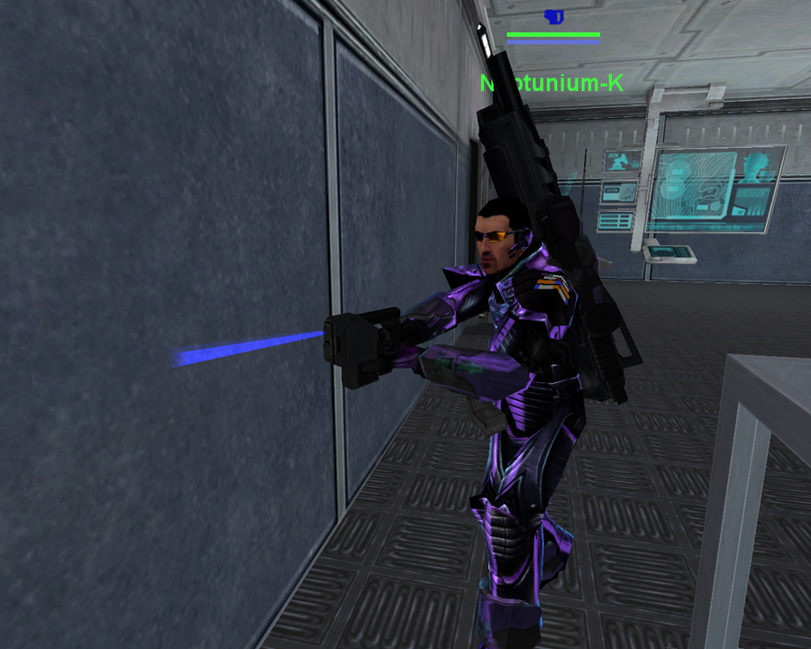

|                            |                               |
| -------------------------- | ----------------------------- |
| **Certification Required** | None                          |
| **Empire**                 | [Common Pool](../terminology/Common_Pool.md) |
| **Primary Mode**           | Hack                          |
| **Secondary Mode**         | \-                            |
| **Ammunition**             | \-                            |
| **Range**                  | 5m                            |
| **Inventory Dimensions**   | 3 x 3 (Pistol Holster)        |
| **Magazine Capacity**      | \-                            |
| **Zoom**                   | None                          |

**Remote Electronics Kit (REK)**

The Remote Electronics Kit ([REK](Remote_Electronics_Kit.md)) is used to hack enemy
terminals and equipment to allow friendly use, upgrade
[facilities](Facility.md) and equipment with enhanced protection
and to remove viruses. The tool may be equipped and used by anyone, but
its usefulness increases with each level of the Hacking
[certification](../certifications/Certification.md) tree.

You can identify what level of Hacking a player has, by the color of the
beam that their REK emits, and the color of the REK symbol that appears
above the players head when they have the REK equipped. These colors are
listed below under their respective Hacking level.

No Hacking Certification:

- Hack [Facility](../locations/Facilities.md) and [Tower](../locations/Towers.md)
  [IFF](../terminology/IFF.md) Door Lock (unlock and re-lock)
- Hack [Tower](../locations/Towers.md) [Control
  Console](../locations/Control_Console.md) (60 seconds)
- Hack [Facility](../locations/Facilities.md) Control Console (60 seconds)

The REK of a non-certified hacker (or "Granny" Hacker) emits a
**yellow** beam.

Hacking Certification:

- Faster hacking of the following;
  - Tower/Facility Control Console: 40 seconds
- Hack [Certification Terminals](../items/Certification_Terminal.md)
- Hack [Lockers](../items/Lockers.md)
- Hack [Medical Terminals](../items/Medical_Terminal.md)
- Hack [Implant Terminals](../items/Implant_Terminal.md)

The REK of a regular Hacker emits a **red** beam.

Advanced Hacking Certification:

- Faster hacking of the following;
  - Tower/Facility Control Console: 20 seconds
- Hack [Equipment terminals](../items/Equipment_Terminal.md)
- Hack [Vehicle Terminals](../locations/Vehicle_Terminal.md)
- Hack [Advanced Medical
  Terminals](../items/Advanced_Medical_Terminal.md)
- [Jack](../terminology/Jack.md) **Empty** Enemy
  [Vehicles](../vehicles/Vehicle.md)
- Deconstruct Enemy [One-Manned Field
  Turrets](One-Manned_Field_Turret.md)
- Hack [Main Consoles](../items/Main_Terminal.md) (in special
  circumstances)

The REK of an Advanced Hacker emits a **purple** beam.

Expert Hacking Certification:

- Faster hacking of the following;
  - Tower/Facility Control Console: 15 seconds
- Increase [Spawn Room](../locations/Spawn_Room.md) [Pain
  Field](../terminology/Pain_Field.md) damage (30 minute duration)
- Increase [Generator](../items/Generator.md) [Pain
  Field](../terminology/Pain_Field.md) damage (30 minute duration)
- [Jack](../terminology/Jack.md) and use enemy [One-Manned Field
  Turrets](One-Manned_Field_Turret.md)
- [Jack](../terminology/Jack.md) **Occupied** Enemy Vehicles
- Upgrade [Aegis Shield Generator](Aegis_Shield_Generator.md)
  with enhanced radar abilities
- Increased Sensor Shield protection while hacking
- Remove viruses from infected equipment

The REK of an Expert Hacker emits a **blue** beam.

The effects of hacking are temporary in all cases except the [Control
Console](../locations/Control_Console.md), Enemy
[Vehicles](../vehicles/Vehicle.md), and Enemy One-Manned Field Turrets.

[Category:Game Items](Category:Game_Items.md)
[Category:Weapons](Category:Weapons.md) [Category:Common Pool
Weapons](Category:Common_Pool_Weapons.md)
