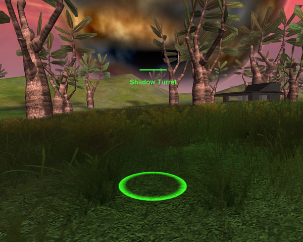

|                            |                                                                                                                                                  |
| -------------------------- | ------------------------------------------------------------------------------------------------------------------------------------------------ |
| **Certification Required** | [Fortification Engineering](../certifications/Fortification_Engineering.md) or [Advanced Engineering](../certifications/Advanced_Engineering.md) |
| **Empire**                 | [Common Pool](../terminology/Common_Pool.md)                                                                                                     |
| **Primary Mode**           | Shadow Turret                                                                                                                                    |
| **Secondary Mode**         | \-                                                                                                                                               |
| **Ammunition**             | [Adaptive Construction Engine](Adaptive_Construction_Engine.md) (ACE)                                                                            |
| **Inventory Dimensions**   | 3 x 3 (Pistol holster)                                                                                                                           |
| **Magazine Capacity**      | 1 use per ACE Unit                                                                                                                               |
| **Zoom**                   | None                                                                                                                                             |

**Shadow Turret**

Shadow Turrets are exactly the same as
[Spitfire Turrets](Adaptive_Construction_Engine.md#Spitfire_Turret) with the
exception that they are cloaked. Shadow Turrets will only become visible when
firing, and will become cloaked again once they have killed their target, or the
target finds cover.

The maximum number of Shadow Turrets that can be deployed is 5, and they count
toward the total number of Spitfires you can deploy. They also share the same
interference range with the spitfire and [Cerberus Turrets](Cerberus_Turret.md).
They can only be deployed in friendly or [neutral](../terminology/Neutral.md)
[SOIs](../locations/Sphere_of_Influence.md).

The Shadow Turret is deployed by the Tertiary Mode of the
[ACE](Adaptive_Construction_Engine.md), and can be selected with the "Change
Ammunition" function (default is "X").

Shadow Turrets can be detected by use of the
[Darklight](../implants/Darklight.md) [implant](../implants/Implants.md), and
will appear in a similar way as players wearing an
[Infiltration Suit](../armor/Infiltration_Suit.md).
