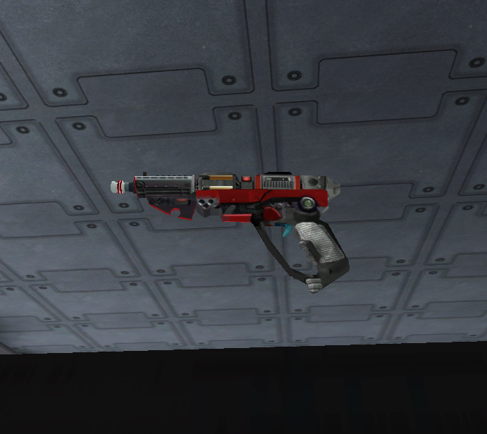

{ class="figure" } {
class="figure" }

|                            |                                                       |
| -------------------------- | ----------------------------------------------------- |
| **Certification Required** | [Medium Assault](../certifications/Medium_Assault.md) |
| **Empire**                 | [Terran Republic](../etc/Terran_Republic.md)          |
| **Primary Mode**           | Single Shot                                           |
| **Secondary Mode**         | All-Magazine Burst                                    |
| **Ammunition**             | [10mm Multi-Phase](../ammunition/10mm_Multi-Phase.md) |
| **Range**                  | 200m?                                                 |
| **Inventory Dimensions**   | 3 x 3 (Pistol Holster)                                |
| **Magazine Capacity**      | 6                                                     |
| **Zoom**                   | x2                                                    |

**Stinger**

The **Stinger** is a powerful
[Medium Assault](../certifications/Medium_Assault.md) pistol. It deals a good
bit of damage per hit with a tight
[cone of fire](../terminology/Cone_of_fire.md), but small clip size. It also
suffers severe [Damage Degradation](../terminology/Damage_Degradation.md) (see
graph at right), making it relatively worthless at targets over 50 meters away.

In the primary firing mode, it fires as a single shot pistol with a tight cone
of fire.

The secondary mode fires all remaining rounds quickly with a very large cone of
fire. You must have at least 75 stamina to fire the secondary mode. The drawback
is that this mode drains all remaining [stamina](../terminology/Stamina.md),
leaving you vulnerable to attack. Thus, you might want to think twice before
firing in this mode. There is a short delay before firing begins with the
secondary fire mode (much like the [Rocklet Rifle](Rocklet_Rifle.md)), with a
distinct sound. This can sometimes give your target enough warning to move out
of the way.

At close range, the Stinger will kill a soldier wearing
[Rexo](../armor/Reinforced_Exo-Suit.md) armor in 5 shots. The
[Eraser](../items/Eraser.md) and [Spear](Spear.md) function identically.
